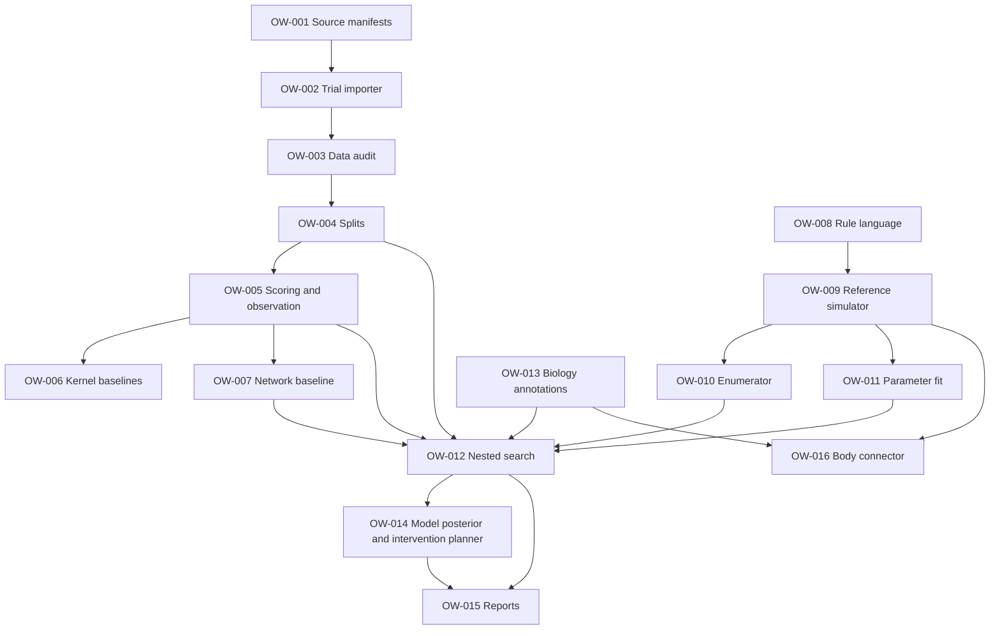

> **Archived.** Frozen copy of the v0.4.0 specification as a single file. The split documents under `docs/` are canonical; edit those, not this file.

# Occam's Worm: A Computational Rule-Discovery Engine for *C. elegans* Neural Emulation

**Technical Research & Engineering Specification**  
**Version:** 0.4.0 (research design; not an implemented system; supersedes 0.3.0)  
**Date:** 2026-10-08  
**Status:** Proposed / falsifiable research program  
**Primary organism:** adult hermaphrodite *Caenorhabditis elegans*  
**Preferred implementation:** Python (JAX or PyTorch) differentiable simulator and parameter fitting; C++20 for the rule-language toolchain, program enumeration, deterministic reference interpreter and CLI; optional Apple Metal accelerator (via metal-cpp) only after profiling  
**Project codename:** `occamworm`  
**License recommendation:** permissive license for original code, subject to review of dependencies, data, and external simulator licenses

> **One-sentence goal:** Discover compact, interpretable, biologically constrained computational programs that reproduce and **predict** causal neural responses in *C. elegans*—and quantify exactly which microscopic details must be preserved for progressively stronger forms of neural emulation.

---

## Changes in 0.4.0

1. **Name.** The project is renamed **Occam's Worm** (`occamworm`). The name states its central selection principle: compact programs are preferred, but only among those that survive held-out interventional tests. C++ libraries use the `ow-` prefix, the C++ namespace is `occamworm`, and implementation tickets are numbered OW-001 onward. The rule language keeps its name, WRL (Worm Rule Language).
2. **C++ replaces Rust** for the rule-language toolchain, program enumeration, the deterministic reference interpreter, the CLI and any later optimized runtime. The Python side (data import, baselines, differentiable simulator and fitting) is unchanged. New material: C++ toolchain and conventions (§14.8), C++-specific determinism rules (§6.6), C++ interfaces (§14.5), sanitizer, fuzzing and two-compiler CI (§16.5), metal-cpp for the optional Metal backend (§18.3), template-specialized kernels (§18.2), and a memory-safety entry in the risk table (§19).

## Changes in 0.3.0

The conceptual framing is now self-contained. The design principles (§1.2), the hypothesis graph (§8), observer-relative equivalence (§9) and the predictive-shortcut tests (§10) are stated in their own terms rather than by reference to an external body of theory, and the corresponding background references are removed. No methods, gates, metrics or claims changed.

## Changes in 0.2.0

This revision responds to a design review of 0.1.0. The substantive changes are:

1. **Indicator-kinetics confound (H1, Paper A).** Shared response kernels can come from the measurement rather than the neurons: directly through a shared indicator filter when models are driven by the nominal stimulus, and indirectly through limited resolvable bandwidth when models are conditioned on the measured autoresponse. Indicator kinetics are now modeled as a separate stage, and a preregistered indicator-kinetics control is required before any claim about shared neural timescales (§1.5, §3.4, §4.5, §11.6, §11.7, §16.3, §20.1).
2. **Within-recording stimulation history.** Sequential stimulations within one recording are not independent exposures. Stimulation order and recent history are now recorded, audited and modeled as a covariate or carried-forward state (§2.3, §2.4, §3.1, §4.1, §6.7, §14.4, §16.3).
3. **Autoresponse conditioning.** T2 is split into T2a (conditioned on the stimulated neuron's measured autoresponse) and T2b (nominal stimulus only). Both are reported; T2a is primary for questions about signal propagation (§3.6, §4.1, §4.3, §11.6, §14.6).
4. **Fold feasibility.** M0 now produces target-by-fold coverage tables for several split schemes, including leave-one-animal-out, and the scheme is frozen from coverage alone, before any model is scored (§2.3, §4.2, §11.1, OW-004).
5. **Implementation split.** The differentiable simulator and parameter fitting are built in Python (JAX or PyTorch). Rust holds the rule-language toolchain, enumeration and the reference interpreter. The forward pass moves to Rust only if profiling justifies it (§6.8, §7.6, §14.1, §14.2, §18.1, OW-009, OW-011).
6. **Complexity accounting.** Structural and parameter description lengths are defined once (`L_struct`, `L_params`, `L_total`) and used consistently, removing a double penalty on parameters (§3.5, §5.7, §7.7, §7.9).
7. **Schedule.** Milestone windows M0–M5 are widened, M2 most of all (§15).
8. **Publication framing.** Papers are written in plain methodological terms, with project-specific terms used only alongside their operational definitions (§20.0).
9. **Minor.** Terminology fix in Appendix A; citation verification is an explicit pre-release task (§22); new open decisions in Appendix B.

---

## Executive summary

Occam's Worm is a computational-science research platform for **program synthesis over biological nervous systems**. It starts with actual neural anatomy, perturbation experiments, molecular annotations and neural activity recordings; defines a typed language of candidate local update laws; executes those laws on anatomical networks; and selects models using held-out **causal predictions**, not attractive emergent patterns or training-set fit alone.

The name refers to the project's selection principle: prefer the most compact program, but only among programs that predict held-out interventions. Brevity is a prior and a tie-breaker; it never substitutes for causal accuracy (§7.9, Anti-pattern D).

The design rests on a few general ideas about computation. Short programs can generate rich behavior. The space of short programs can be enumerated and searched systematically. Whether an observable can be predicted faster than by simulating every step is an empirical question, answered separately for each observable. Competing hypotheses are worth keeping as a branching set rather than collapsing early to one winner. And equivalence between models is always relative to a declared observer. §1.2 turns each idea into an operational rule with a guardrail. None of them is assumed to be a fact about biology; each earns its place only through held-out predictive tests.

The shortest credible path to a publishable result is deliberately smaller than a whole moving worm:

1. Audit the **trial-level wild-type** neural signal-propagation atlas, keeping animal and stimulation identity intact.
2. Establish strong, leakage-free baselines for **shared-timescale versus independent-response kernels**, with the calcium indicator modeled as a separate stage so that measurement effects are not mistaken for shared neural timescales.
3. Construct a minimal typed rule grammar that can express those baselines and selected mechanistic alternatives.
4. Discover compact rules that predict **held-out animals, stimuli, and stimulation targets**.
5. Test predictions on an external perturbation, genotype, or independent dataset, with genotype-specific nuisance effects treated explicitly.
6. Only then connect a validated neural model to an embodied worm and test closed-loop behavior.

The project's claimed novelty is **not** that small programs yield complex patterns, that *C. elegans* has a connectome, or that a virtual worm can crawl. It is the intersection of **automated rule search + anatomical constraints + trial-level causal validation + explicit equivalence classes + experiment selection**.

### Primary scientific deliverable

A frozen, reproducible benchmark and at least one compact shared-rule model that improves **held-out predictive log likelihood** over an appropriately matched baseline, without a large loss of calibration or mechanistic plausibility. If no discovered model improves the baselines, the negative result should quantify where simple rules fail and what measurements could resolve the ambiguity.

### Primary engineering deliverable

A local-first CLI/library capable of ingesting experimental datasets, validating provenance, compiling a small rule DSL to deterministic execution, fitting model parameters, evaluating held-out data, and producing audit-ready comparison reports.

---

# 1. Scientific motivation and scope

## 1.1 The actual scientific problem

A structural connectome gives a graph of anatomical connections. It does **not** uniquely determine functional dynamics because synaptic signs, intrinsic neuronal response properties, neuromodulatory state, gap junction biophysics, receptor expression, physiology, measurement operators, body feedback, and developmental differences can alter the response to the same connectivity.

The neural signal-propagation atlas of Randi et al. measured responses for **23,433 head-neuron pairs** in **113 animals**, with highly unequal replication (some pairs observed only once, others many times). A pairwise aggregate is **not** a set of 23,433 independent training examples; animals and stimulus trials create a strongly clustered observational structure. The paper also reports extrasynaptic signaling, including dense-core-vesicle-dependent effects. These observations motivate a model that is more expressive than adjacency-matrix multiplication, yet need not begin with hundreds of custom neuronal differential equations. [R1]

The target is therefore a sequence of increasingly demanding questions:

- **Prediction:** Which compact local dynamical laws predict measured neural responses?
- **Generalization:** Do those laws transfer to new animals, stimulation targets and perturbations?
- **Identification:** Which mechanisms can current data distinguish, and which are empirically equivalent?
- **Minimal sufficiency:** What is the least biological detail needed to reproduce a specified set of causal observables?
- **Embodiment:** Can the same inferred nervous system generate appropriately constrained sensorimotor behavior in a closed-loop body?

These questions are separable. A good model for an isolated optogenetic response is not automatically a model of locomotion, and a locomoting synthetic controller is not automatically a faithful neural emulation.

## 1.2 Five computational design principles

| Principle | Operational interpretation in Occam's Worm | Guardrail |
|---|---|---|
| Simple programs can generate complexity | Enumerate small local dynamical rules rather than starting with maximal equation complexity | Complexity of output is **not** evidence of biological correctness |
| The space of short programs can be explored systematically | Treat short programs as a finite search space, with syntax, semantics and canonicalization | Search bias must be measured; grammar choice is a strong prior |
| Some dynamics may have no predictive shortcut | Empirically ask which observables need full simulation and which are predictable from reduced models | Do not infer the absence of a shortcut from a visually complex trajectory |
| Competing hypotheses form a branching structure | Retain a population of plausible hypotheses and their divergent experimental predictions | Branching is **bookkeeping over hypotheses**, not a claim about the system's dynamics |
| Equivalence is relative to an observer | Define explicit measurement operators and intervention-specific equivalence classes | Observational equivalence is **not** identity of mechanism, consciousness or subjective experience |

## 1.3 In scope

**Phase 1–3:** adult hermaphrodite, head-neuron stimulation/response data; model comparison; rule language; parameter inference; generalization; controlled synthetic tests; uncertainty and equivalence analysis.

**Phase 4:** genotype-specific or molecular interventions, where dataset and replication actually support it.

**Phase 5:** freely moving neural recordings; motor readouts; neural-body-environment co-simulation; realistic perturbation tests.

**Research extensions:** developmental variability, sensory adaptation, neuromodulatory fields, individual-specific model inference, minimum scanning requirements.

## 1.4 Out of scope for v0.1

- Claiming to produce a complete conscious or mind-uploaded worm.
- A new automated electron microscopy reconstruction system.
- Replacing all biological chemistry with a Boolean network by assumption.
- Predicting mutant phenotypes before checking mutant sample sizes and confounds.
- Producing realistic movement solely by training an unrestricted neural-to-muscle decoder.
- Inferring a unique molecular mechanism from calcium traces alone.
- Treating all 302 neurons as simultaneously observed in the head-only stimulation atlas.
- Building a full 3D body solver before passing neural held-out tests.

## 1.5 Falsifiable hypotheses

**H1 — Shared computational motifs:** Across many stimulated neurons, a small collection of shared dynamical response motifs explains held-out calcium responses nearly as well as or better than independently fitted kernels under matched regularization. H1 is a claim about **neural** dynamics: it is supported only if the shared motifs survive the indicator-kinetics control of §4.5. Shared kernels that the control cannot separate from measurement effects support only the weaker statement that the recordings are dominated by a common sensor filter at the available resolution.

**H2 — Compositional local rules:** A low-description-length, network-executed rule grammar predicts held-out neural perturbations better than an equally budgeted linear anatomical model and independent pairwise-response model.

**H3 — Identifiable causal distinctions:** A set of apparently equivalent rule programs can be separated by a small number of prospective or naturally held-out perturbations chosen using expected information gain.

**H4 — Fidelity hierarchy:** More stringent interventions split coarse functional-equivalence classes in measurable and interpretable ways.

**H5 — Embodied transfer (stretch):** A model selected on neural causal data can be coupled to a body without an unconstrained learned controller and retain meaningful locomotor behavior and perturbation sensitivity.

**Nulls:** no transferable shared motifs; apparent shared motifs explained by indicator kinetics or resolvable bandwidth alone; improvements vanish under animal-wise splits; rules perform no better than linear baselines; data are too sparse to distinguish mechanism families; closed-loop behavior fails without arbitrary readout training. Any of these is a scientifically acceptable outcome if established rigorously.

---

# 2. Prior work and source datasets

## 2.1 Data assets and what can be claimed

| Source | Primary contents | Planned use | Caveats |
|---|---|---|---|
| Randi et al. 2023 signal-propagation atlas | Optogenetic stimulation, observed neuronal calcium responses, per-recording fits; WT and available mutant conditions | Primary causal training/evaluation | Heterogeneous counts; calcium rather than membrane voltage; most head pairs not strongly and reliably connected |
| Leifer Lab `pumpprobe` | `Funatlas`, `Fconn`, per-animal data interfaces, kernels and occurrence matrices | Reference importer; trace-level audit | Depends on preprocessing and external data layout; do not mistake aggregated kernels for raw trials |
| OpenWorm Connectome Toolbox | Multiple curated anatomical networks, including chemical and electrical connections | Anatomical priors and provenance | Different connectome sources and developmental stages are not interchangeable |
| Worm Neuro Atlas | Transcriptomic, receptor/peptide, transmitter and atlas integrations | Biological type constraints and candidate extrasynaptic edges | Expression implies potential capability, **not** proof of functional communication |
| WormWideWeb / Atanas et al. | Freely moving whole-brain activity and behavioral annotation | External dynamic and behavioral evaluation | Experimental conditions/observables differ from head-fixed stimulation atlas |
| BAAIWorm | Published closed-loop worm brain–body–environment reference | Embodiment baseline and interface reference | It already demonstrates embodied simulation; cannot be presented as a novel milestone by itself |

Links and citations appear in §22. [R1–R5]

## 2.2 Source-of-truth acquisition policy

1. Download from the original repository or DOI; capture immutable archive checksums.
2. Record DOI, publication year, upstream commit/tag, retrieval date, license, and data-processing version.
3. Prefer official dataset/analysis libraries to reconstructing responses from paper figures.
4. Preserve all source trial and animal identifiers; never discard them when creating aggregation tables.
5. Maintain both original data and normalized datasets; do not modify original bytes.
6. Mark unknown fields `null` with a machine-readable reason, rather than silently imputing.
7. Never label a pair that was not observed as a negative response.
8. Record whether a response is directly measured, fitted, or inferred from a paper-level statistic.

## 2.3 Immediate data-audit gate

Before developing any novel rule model, produce a machine-generated report with:

- Counts of **unique animals**, recording sessions, stimulation trials and stimulus targets by genotype.
- Distribution of observations per stimulated→responder pair, including zero/one/two/many-repeat strata.
- Count of distinct responders per stimulated neuron with usable traces.
- Distribution of stimulus duration, amplitude, timing, sampling rate and measured windows.
- Counts of valid autoresponses, sham events, missing traces, segmentation/motion artifacts and uncertain neuron identities.
- Trial-to-trial versus animal-to-animal variance, conditioned on stimulated neuron.
- Percentage of pairs with enough animal-level repeats for actual held-out evaluation.
- Intersection of neuron IDs across functional atlas, anatomical graph and molecular annotations.
- Coverage of wild-type, `unc-31`, and any other genotype **without assuming** a sufficient sample size.
- Feasibility of the specific shared-timescale experiment under a grouped animal split.
- Stimulation order within each recording: number of prior stimulations, time since the previous stimulation, and identity of recently stimulated targets.
- Within-recording drift: whether autoresponse and responder amplitudes change with stimulation index or elapsed recording time.
- Target-by-fold coverage tables for at least three candidate split schemes (for example 5-fold grouped, 10-fold grouped and leave-one-animal-out), reporting for each eligible target how many outer test folds and inner validation folds contain it.
- Identity of the calcium indicator, any published kinetic parameters for it, and the autoresponse data available to estimate its impulse response (§4.5).

**Go/no-go criterion:** at least one clearly specified collection of stimulus targets must admit genuine animal-held-out evaluation with nontrivial response variability. If not, the first paper becomes a dataset/identifiability audit rather than a misleading rule-discovery result.

**Split selection:** choose the split scheme from the coverage tables alone, before any baseline or candidate is scored, and record the choice and rationale in the experiment registry. Prefer the scheme that keeps the most eligible targets present in held-out folds, subject to keeping all of an animal's sessions and trials in the same fold. Leave-one-animal-out is admissible for the outer loop when grouped k-fold leaves eligible targets without held-out coverage.

## 2.4 Trial inclusion and response definition

A trial is an experimental exposure, not a stimulated–responder pair. A single stimulation produces a vector of simultaneously observed responses. This correlation must be represented in modeling and bootstrap sampling.

For every trial:

- Use pre-stimulus interval to estimate fluorescence baseline and uncertainty.
- Preserve the target's measured autoresponse as a possible input covariate **only if that quantity is available for the intended prediction task**.
- Account for target-neuron stimulation artifacts and spectral contamination.
- Distinguish *unobserved*, *observed but uninterpretable*, and *observed near noise floor*.
- Maintain masks for per-frame motion/extraction failures.
- Avoid hard thresholding to only significantly responsive downstream cells for primary likelihood metrics; this creates selection bias.
- Maintain a separate vetted responder subset for exploratory kinetic-shape studies.
- Record the trial's position in its recording: stimulation index, elapsed recording time, time since the previous stimulation, and the previous target. Trials from one recording share an evolving animal state; they are not exchangeable exposures.
- Store the stimulated neuron's own trace (the autoresponse) as a separately typed input channel. It is an allowed input in T2a and is never scored as a responder output; in T2b it may be scored separately as a stimulation-efficacy prediction.

**Important:** Trial-level negative examples are crucial. A model that predicts a large response everywhere must be penalized even if it fits the strongest pairs well.

---

# 3. Formal problem statement

## 3.1 Experiment and observation notation

An experiment is indexed by animal/session `a`, trial `r`, and stimulation target `j`. Let:

- `G_a`: observed or canonical typed anatomical graph for animal/condition `a`.
- `z_a`: known animal metadata (genotype, acquisition setup, strain, experimental batch).
- `u_{a,r}(t)`: optogenetic input waveform, target location and stimulation timing.
- `y^{auto}_{a,r}(t)`: measured calcium trace of the stimulated neuron itself (autoresponse); an input in T2a.
- `s_{a,r}`: stimulation history for trial `r` within its recording: prior targets, their timing and their measured autoresponses.
- `X_{a,r}(t)`: unknown internal state of the neural system.
- `Y_{a,r,i}(t_k)`: measured calcium response for neuron `i`, if visible/identified at frame `k`.
- `M_{a,r,i,k}`: validity mask for each observation.
- `R`: candidate update program; `theta`: shared physical/dynamical parameters.
- `eta_a`: animal/session-specific nuisance effects; `phi`: observation-system parameters.

The forward model is

\[
X_{t+\Delta t}=F_{R,\theta}(X_t,G_a,u_{a,r}(t),z_a,\xi_t),
\qquad
Y_{i,k}\sim p_\phi(\cdot\mid H_\phi[X_i]_{t_k},\eta_a).
\]

`xi_t` denotes optional explicitly specified process noise. The full model is jointly conditional on stimulation and anatomical context, and must include an **observation operator** mapping latent membrane/synaptic dynamics into measured calcium fluorescence.

Because stimulations within a recording are sequential, the state at trial onset is not an independent draw: `X_{a,r}(t_0)` depends on the end state of trial `r-1` and on `s_{a,r}`. §6.7 defines the allowed policies for representing this dependence.

## 3.2 Typed connectome

Represent anatomy as a typed multigraph, not one monolithic signed matrix:

\[
G=(V,E_{chem},E_{gap},E_{mod},E_{nmj},A_V,A_E).
\]

- `V`: canonical neuron IDs; possible neurons beyond the stimulation-atlas coverage retained if included in a network simulation.
- `E_chem`: directed chemical synaptic counts and source provenance.
- `E_gap`: electrical junctions with symmetrical default conductance and provenance.
- `E_mod`: candidate extrasynaptic peptide/receptor routes, preferably sparse/prior-weighted rather than declared proven.
- `E_nmj`: validated neuron-to-muscle mapping for later embodiment.
- `A_V`: cell type, transmitter/receptor evidence, anatomy region, coordinates if available.
- `A_E`: counts, confidence, developmental stage, reconstruction method, evidence source.

Missing synaptic sign is an *unknown parameter or constrained categorical uncertainty*, never silently determined by presynaptic cell name alone. Resolve differing canonical IDs and bilateral aliases with an explicit mapping table and version.

## 3.3 Neural state schema

Start with the minimum state sufficient for a family of models:

\[
X_i(t)=(v_i,c_i,h_i,\ell_i,\rho_i),
\]

where `v` is activation/membrane proxy, `c` calcium proxy, `h` adaptation or refractory state, `ell` a compact local memory register, and `rho` optional neuromodulator/receptor state. Each candidate rule declares exactly which registers exist. Absent registers consume **zero** code-length budget and should not be allocated in the compiled simulation.

A large class of candidates has the form

\[
q_i(t)=\sum_{j\to i} w_{ji}\,T_{ji}\bigl(v_j(t-d_{ji}),s_{ji}(t)\bigr)
+q^{gap}_i(t)+q^{mod}_i(t)+u_i(t),
\]

\[
(v_i,h_i,\ell_i)_{t+\Delta t}
=R_\theta\bigl(v_i,h_i,\ell_i,q_i,\operatorname{type}(i)\bigr).
\]

This *general form* does not require every rule to have delays, synaptic state, or modulation.

## 3.4 Measurement model

A minimal calcium observation model is

\[
\dot c_i=-c_i/\tau_{Ca,i}+\alpha_i f_{Ca}(v_i),
\qquad
\hat y_i(t)=b_{a,i}+g_{a,i}\,\mathcal{H}(c_i(t);\phi)+\epsilon_i(t),
\]

where `H` may be linear or saturating, and the noise model can be Student-t or temporally correlated. Filter bandwidth, sampling times, baseline drift and stimulus-to-imaging alignment must be represented.

**Identifiability warning:** calcium traces generally cannot uniquely recover voltage, exact spike timing, membrane conductances or release kinetics. Never interpret a fitted latent `v_i` directly as measured biological membrane voltage unless separately calibrated.

**The indicator is shared by construction.** Every observed neuron is read through the same indicator, so any part of the response time course set by the indicator is common to all responders regardless of neural dynamics. The indicator's impulse response (and saturation, if modeled) must be parameterized separately from neural kernels, estimated from data that constrain it, and reported. Claims about neural timescales are made only about what remains after this stage (§4.5).

## 3.5 Primary optimization objective

\[
\mathcal J(R,\theta,\phi)=
\underbrace{-\log p(Y_{train}\mid R,\theta,\phi,G,U)}_{\text{predictive fit}}
+\lambda L_{total}(R,\theta)
+\gamma P_{bio}(R,\theta),
\qquad
L_{total}(R,\theta)=L_{struct}(R)+L_{params}(\theta\mid R).
\]

- `L_struct`: bit length of the program structure under a frozen prefix-free encoding (AST, topology overrides, type-dispatch tables; §5.7).
- `L_params`: bit length of the trainable parameters at their declared precision, given the structure (§5.7). This is the only parameter-complexity term; there is no separate parameter penalty, so parameters are not charged twice.
- `P_bio`: penalties or hard constraints from known biophysics and anatomy.

Parameter fitting happens **only on training folds**; hyperparameters and rule search use inner validation folds; the untouched outer fold is inspected only after model selection.

## 3.6 A hierarchy of prediction tasks

| Task | Inputs at inference | Predicted quantities | Interpretation |
|---|---|---|---|
| T0 trace reconstruction | Complete observed input and fit animal | Same animal/trial trace | Debugging only |
| T1 new-trial prediction | Known stimulus target, animal context; no responder future trace | Held-out trials from training animals | Weak generalization |
| T2a new-animal prediction, autoresponse-conditioned **primary** | Stimulus design, public covariates, stimulation history, and the stimulated neuron's measured autoresponse in the test trial | All observed responder traces in unseen animals | Signal propagation given the stimulation actually achieved |
| T2b new-animal prediction, nominal stimulus | Stimulus design, public covariates and stimulation history only | Responder traces (and, separately, the autoresponse) in unseen animals | Propagation plus stimulation efficacy; harder |
| T3 new-stimulus-target prediction | Anatomy and source-independent priors; target never fit | Responses to held-out targets | Stronger rule compositionality |
| T4 cross-condition prediction | WT fit, predefined intervention transform | Mutant/perturbed responses | Mechanistic stress test |
| T5 closed-loop embodiment | Sensory input and internal state | Neural and motor/body responses | Long-horizon emulation test |

T3 inherits the T2a/T2b distinction; every T3 result states which conditioning it uses.

**Why both T2 variants.** Achieved stimulation varies substantially across trials. T2a separates propagation from stimulation efficacy and is the natural primary task for questions about network dynamics. T2b tests whether a model also predicts how strongly a nominal stimulus drives its target, which matters for prospective experiment design (§8). Report T2a and T2b separately; never average them into one score.

**Invalid shortcut:** neither T2a nor T2b may use per-animal nuisance estimates derived from that animal's hidden post-stimulation responder traces. In T2a the autoresponse is an observed input, not a responder output, so using it is legitimate; using any responder's post-stimulus trace for calibration is not. If an allowed calibration period exists, specify its duration, information and cost before splitting.

---

# 4. Baseline first: shared-timescale experiment

Before unconstrained program search, perform a narrow and highly interpretable test of the central simplifying assumption.

## 4.1 Candidate models

For stimulated neuron `j`, and responder `i`, consider a stimulus-convolved response:

\[
\hat y_{ij}(t)=b_{ij}+a_{ij}\,(u_j*k_{ij})(t).
\]

In T2a, `u_j` is the measured autoresponse of the stimulated neuron. In T2b, it is the nominal stimulus waveform passed through a fitted stimulation-efficacy model. In both cases the indicator stage of §3.4 is represented explicitly (§4.5).

**B0 — Null/sham:** no causal stimulus response beyond baseline, drift and noise.

**B1 — Shared timescale / shared latent kernel:**

\[
\hat y_{ij}(t)=b_{ij}+a_{ij}\,(u_j*h_j)(t-\delta_{ij}),
\]

where `h_j` is shared among responders of one stimulus target, with limited or zero per-pair delays (separate preregistered variants). More stringent version: a small *global* bank of shared kernels across stimulus targets.

**B2 — Low-rank kernel bank:**

\[
k_{ij}(t)=\sum_{m=1}^{K} a_{ijm}h_m(t), \quad K\in\{1,2,4,8\},
\]

with all kernels regularized and causal. This explicitly measures whether a small set of temporal primitives suffices.

**B3 — Independent pair kernels:** each `(i,j)` has an independently parameterized stable response kernel, with matched shrinkage and trial-level uncertainty.

**B4 — Linear network dynamics:**

\[
\dot x=(-D+W)x+Bu(t),\quad \hat y=\mathcal H(Cx),
\]

with anatomical support and regularized signs/weights. Compare both fixed anatomically-derived and learned constrained `W`.

**B5 — Conventional simple neuron network:** leaky-rate units with saturating transfer and fixed topology; optional adaptation.

**B6 — Shared latent stochastic state model:** one/few network-scale factors with state-space dynamics and observed target input, to exclude trivial low-rank-factor explanations unrelated to anatomy.

**History variants (all of B0–B6).** Each baseline is fitted twice: without history, and with a declared stimulation-history term, for example a per-animal gain that changes with stimulation index, an exponentially weighted sum of recent autoresponses, or carryover of the previous trial's responder state. The history form is chosen from training-fold audits and frozen before outer scoring. If the history variant does not improve inner-validation scores, report that and keep the simpler variant.

B1 is a restricted case of B3 under compatible parameterizations, but their predictive comparisons are only meaningful when fitted with **equally legitimate regularization/optimization**. Differences in flexibility and stimulus target coverage must be reported.

## 4.2 Data eligibility

Predefine minimum requirements from the real audit rather than inventing sample counts. A stimulus target enters primary evaluation if:

1. Multiple identified responders have valid time series in multiple animals.
2. Under the frozen split scheme (§2.3), the target appears in at least one outer test fold and in inner validation folds, with independent animal-level observations.
3. There is sufficient temporal resolution to distinguish the candidate kernel families.
4. Controls/near-null responses are included rather than post-selected away.

Publish the full flowchart of excluded targets and reasons. If fewer targets meet criteria than expected, narrow claims rather than relaxing splits.

## 4.3 Primary statistic

For each held-out animal, score the **joint collection** of eligible observed traces using a predictive log density with masks and calibrated noise. Report:

\[
\Delta\mathrm{NLL}_{a}=\mathrm{NLL}_{a,baseline}-\mathrm{NLL}_{a,candidate},
\]

with positive improvement preferred. Also report per-target results and a hierarchical animal-level confidence interval. Report T2a and T2b separately; T2a is the primary statistic.

Do not use mere Pearson correlation as the main metric; it ignores scale, sign, baseline bias and predictive uncertainty.

## 4.4 Exit gate

Proceed from B1–B6 to program search only after:

- A fully frozen animal-wise benchmark exists.
- A competent baseline can reproduce qualitatively correct known responses and near-null cases.
- Held-out uncertainty is quantified.
- At least one hypothesis about temporal sharing remains plausible and falsifiable.
- The indicator-kinetics control (§4.5) has been run and its outcome recorded.
- History and no-history variants of the baselines have been compared.

A null result is permitted: if independent kernels dominate predictively after fair complexity control, the next program grammar must admit greater neuron/pair-specific state rather than pretending that all responses share one clock.

## 4.5 Indicator-kinetics control

A shared response kernel can be produced by the measurement rather than the neurons. How it happens depends on the task.

In T2b, and in any model driven by the nominal stimulus, every predicted trace passes through the same indicator filter, so the indicator's impulse response appears directly in every fitted kernel and makes kernels look alike.

In T2a, if the indicator were linear and time-invariant, its filter would cancel between the measured autoresponse (input) and the responder trace (output), and the fitted kernel would estimate the neural transfer. The cancellation is incomplete in practice. Indicator saturation and other nonlinearities break it. And because the indicator low-pass filters both input and output, kernel components faster than the indicator are buried in noise; regularization then shrinks those unresolvable components toward a common shape, which can look like shared timescales.

The control is preregistered before outer scoring:

1. Estimate the indicator impulse response (and saturation, if modeled) separately from neural kernels, using training-fold autoresponses and published sensor kinetics where available.
2. From the indicator model and the measured noise level, compute the resolvable kernel bandwidth and report it.
3. Fit B1–B3 with an explicit indicator stage and report the shared kernels' timescales alongside the indicator's.
4. Generate synthetic data with known, distinct neural kernels behind the estimated indicator and noise, run the full pipeline, and report how often it wrongly favors B1 or B2 (the false-sharing rate).

**Interpretation rule.** H1 is supported as a claim about neural dynamics only if (a) in T2b and other nominal-stimulus models, the favored shared kernels differ from the indicator impulse response beyond its uncertainty, and (b) in all tasks, the false-sharing rate is low at the measured noise level, using a threshold fixed in Appendix B before outer scoring. Otherwise the result is reported as: shared kernels are not distinguishable from measurement effects at the available resolution.

---

# 5. The Rule Language (`WRL`)

## 5.1 Purpose

`WRL` (Worm Rule Language) is a small, typed, deterministic-by-default domain-specific language for update rules on biological multigraphs. It must support exhaustive short-program enumeration, human inspection, symbolic rewrites, structured mutation, parameter inference, serialization, and compilation.

**Design preference:** restrict the grammar enough that searching it is scientifically interpretable and computationally tractable. Do not turn it into a general unrestricted neural network language.

## 5.2 Types

```text
Scalar        finite float with unit annotation
Bool          Boolean predicate
IntSmall      bounded integer state
State<K>      K-valued internal local state
NeuronId      canonical atom, only in metadata
NeuronType    categorical anatomical/functional class
EdgeType      Chemical | Gap | Modulatory | NMJ
Signal        state or message at a declared time
Duration      quantity with time unit
Count         nonnegative multiplicity
Vector<N>     small fixed-size vector, optional after v0.1
```

Every operation checks unit compatibility. Distinguish parameter values in physical units from arbitrary dimensionless activation.

## 5.3 Core expressions

| Family | Operations | Notes |
|---|---|---|
| Constants/inputs | `const`, `stimulus`, `state`, `edge_weight`, `type_mask` | Explicit permitted observables |
| Arithmetic | `add`, `mul`, `neg`, `clamp`, `abs`, `min`, `max` | No unbounded division by unknown |
| Nonlinearities | `relu`, `tanh`, `sigmoid`, `threshold`, `piecewise` | Each has a complexity cost |
| Neighborhood | `sum_in`, `mean_in`, `sum_gap`, `sum_mod` | Typed, static topological neighborhoods |
| Temporal | `delay`, `leaky_integrate`, `decay`, `hold`, `rise` | State allocation declared explicitly |
| Branching | `if`, `select` | Condition dependency must be local |
| Stochastic | `normal_noise`, `bernoulli` | Only in stochastic grammar tier |
| Observation | `calcium_filter`, `fluorescence`, `readout` | Measurement model versioned separately |

Disallow introspection of hidden test data, arbitrary graph-global broadcast except explicit declared signals, unrestricted recursion, dynamic code generation, and dependence on raw neuron identifiers as lookup-table keys in the smallest grammar tier.

## 5.4 Grammar tiers

- **G0 — Truth-table cellular automata:** bounded discrete states, neighbor state counts, deterministic transition table. Useful for synthetic tests and emergence maps; not presumed biologically realistic.
- **G1 — Stable continuous local rules:** leaky integration, thresholds, saturation, sign-constrained edges, optional delay.
- **G2 — Local memory:** one or two adaptation/synaptic state registers, bounded delays.
- **G3 — Type-conditioned rules:** rule selection by neurotransmitter/receptor/cell class, without individual ID memorization.
- **G4 — Modulatory fields:** sparse receptor-dependent spatial message fields and low-dimensional slow state.
- **G5 — Structured stochastic rules:** process noise and between-animal parameter distributions.

**Promotion rule:** later tiers are unlocked only when earlier tiers leave reproducible residual structure and the extra complexity can be evaluated with the available data.

## 5.5 Illustrative WRL program

This is **illustrative syntax**, not a working parser nor a calibrated biophysical equation:

```yaml
wrl_version: "0.1"
rule_id: leak_exc_inh_adapt_v1
neuron_state:
  v: {unit: dimensionless, init: 0.0}
  h: {unit: dimensionless, init: 0.0}
inputs:
  stimulus: {unit: dimensionless}
  chemical_exc: {op: sum_in, edge: chemical_exc, signal: v_delayed}
  chemical_inh: {op: sum_in, edge: chemical_inh, signal: v_delayed}
parameters:
  tau_v: {unit: s, value: 0.25, trainable: true, lower: 0.005, upper: 10.0}
  tau_h: {unit: s, value: 2.0, trainable: true, lower: 0.01, upper: 30.0}
  gain: {unit: dimensionless, value: 1.0, trainable: true, lower: 0.0, upper: 20.0}
  adapt: {unit: dimensionless, value: 0.2, trainable: true, lower: 0.0, upper: 10.0}
update:
  drive: "gain * (chemical_exc - chemical_inh + stimulus) - adapt * h"
  v_next: "v + dt/tau_v * (-v + tanh(drive))"
  h_next: "h + dt/tau_h * (-h + max(v, 0))"
observation:
  operator: calcium_linear_v1
```

**Compiler must reject** this explicit-Euler update when a proposed `dt/tau` exceeds its declared stability constraint, or replace it with a separately specified stable integration primitive whose semantics are documented. Inputs `chemical_exc` and `chemical_inh` require biological priors or latent edge-sign inference; they are not silently derived from anatomical synapse counts.

## 5.6 Canonical program representation

1. Parse into a typed abstract syntax tree (AST).
2. Lower to SSA-like intermediate representation with explicit state writes.
3. Normalize commutative operators and constant folding.
4. Eliminate dead registers and algebraically redundant branches.
5. Alpha-rename bound variables and perform common-subexpression elimination.
6. Assign deterministic `program_hash = SHA256(canonical_IR)`.
7. Record the grammar version and compiler build in every result.

**Distinct syntax with equivalent tested behavior** may be grouped after evaluation, but do not claim formal semantic equivalence without an actual proof.

## 5.7 Complexity accounting

Define `L_struct` from a prefix-free encoding of AST operators, argument references, register declarations, fixed typed constants and rule-dispatch tables. Define `L_params` from the trainable parameters at their declared precision; precision must be charged, not merely parameter count:

\[
L_{struct}=L_{AST}+L_{topology\ overrides}+L_{type\ dispatch},
\qquad
L_{total}=L_{struct}+L_{params}.
\]

`L_struct` depends only on the program; `L_params` depends on the fitted values and their declared precision. The objective (§3.5), the program prior (§7.7) and the Pareto front (§7.9) all use these same quantities, and nothing else charges for complexity. Store the actual bit accounting in each run. A 3-line rule with 100,000 per-pair learned values is **not** a low-complexity model.

## 5.8 Biological constraints

Hard constraints for selected tiers:

- Nonnegative conductance magnitudes for electrical junctions.
- Physical units and positive time constants.
- Zero contribution from truly absent chemical edges unless an allowed extrasynaptic pathway is declared.
- Symmetric gap-junction coupling in the default model, with exceptions explicitly supported by evidence.
- Bounded activity or mathematically stable dynamics over specified test ranges.
- Explicit simulator timing and finite event delays.

Soft priors may incorporate transmitter phenotype, receptor expression, known functional signs and regional information, **with provenance**. Priors must not leak an outcome label from the held-out perturbation.

---

# 6. Deterministic simulation runtime

## 6.1 Execution semantics

**Default:** synchronous fixed-timestep transitions, with a stable and fully specified order:

1. Apply exogenous stimulation and any declared sensory input at time `t`.
2. Read snapshot of all old neuronal states and delay buffers.
3. Compute chemical message aggregation on the old states.
4. Compute electrical coupling on a separately specified, stable discretization.
5. Update local state registers, using no partially updated neighbor state.
6. Evolve calcium/observation states.
7. Write the new state arrays and delay buffers.
8. Sample observables exactly at configured acquisition timestamps.

This avoids source-order dependence and makes the update rule reproducible. Future event-driven/asynchronous semantics must be a new execution mode, not an undocumented optimization of the synchronous one.

## 6.2 Array representation

For `N` neurons and `E` anatomical edges:

```text
neurons:
  id[N]              canonical ID index
  type[N]            compact categorical code
  state_0[N]         contiguous float32/float64
  state_1[N]         contiguous optional register
  obs_state[N]       separate calcium filter state

chemical graph:
  in_offsets[N+1]    CSR rows, postsynaptic target
  pre_id[E]          presynaptic index
  weight[E]          synaptic magnitude / latent weight
  edge_type[E]       transmitter/sign class, if supported
  delay_bucket[E]    integer delay index

gap graph:
  symmetric edge list, with separate coupling weights

modulatory graph:
  receptor/ligand-compatible candidate edges or spatial field model

simulation:
  delay_ring[D][N]   only if enabled
  stimulus[T][N]     sparse target representation preferred
  outputs[T_sampled][N_observed]
```

The canonical CSR orientation must be documented, tested and versioned; many neural simulation errors come from inadvertently reversing the source and destination indices.

## 6.3 Gap junction integration

Do **not** treat electrical connections as two arbitrary directed chemical edges. A standard electrical-coupling term is

\[
q^{gap}_i=\sum_j g_{ij}(v_j-v_i).
\]

The integration method should account for stiffness (e.g., stable semi-implicit solve for a linear coupling block), preserve constant-voltage equilibrium in the absence of other terms, and pass energy/dissipation sanity checks. The exact physical interpretation depends on the chosen state variable.

## 6.4 Delay semantics

- Quantize `d_ij` to simulation ticks in the initial runtime.
- Quantization error bounded and reported as a function of `dt`.
- No negative delays; zero-delay means old-timestep state in synchronous mode.
- Delayed signals draw from initialized history buffers; the history initialization policy is declared.
- Future continuous-delay interpolation is an explicit feature with numerical equivalence tests.

## 6.5 Stability and boundedness

For every program before fitting:

- Check divisions/parameter domains and reject NaN-producing programs.
- Run random and adversarial input tests for a configured temporal horizon.
- Reject or penalize unbounded state growth not physically justified.
- Check timestep convergence by comparing `dt` and `dt/2`; tolerance depends on observable and model family.
- Distinguish dynamical instability (potentially meaningful) from numerical instability (simulation bug).
- Keep a simulator diagnostics vector, not only an aggregate model fitness.

## 6.6 Randomness, determinism and reproducibility

By default the candidate is deterministic. For stochastic programs:

- Use counter-based or otherwise reproducible splittable RNG streams.
- Seed by `(experiment_id, program_hash, animal_id, trial_id, replicate_id)`.
- Record the PRNG algorithm and seed derivation.
- Implement sampling distributions explicitly (for example, normal variates by a documented transform). C++ standard-library distributions such as `std::normal_distribution` are implementation-defined and produce different sequences on different standard libraries, which breaks cross-platform replay.
- Use common random numbers when comparing candidate predictions where appropriate.
- Report repeated Monte Carlo predictive uncertainty rather than one lucky rollout.
- Do not confuse parameter uncertainty with intrinsic dynamical process noise.

## 6.7 Initial conditions

Initial state can materially change long-term neural response. Define three policies:

1. **Steady-state:** solve or burn in under measured baseline stimulus.
2. **Measured-calibration:** infer a constrained initial-state posterior from a fixed pre-stimulation window.
3. **Hierarchical:** draw initial states from a distribution learned on training animals.
4. **History-conditioned:** for sequential stimulations within one recording, carry the simulated state forward from the previous trial across the recorded inter-stimulus interval, or use the declared reduced history term of §4.1.

Policies 1–3 treat trials as independent exposures and are acceptable only if the M0 audit finds no material order or carryover effects. Otherwise policy 4 is the default.

The outer-test policy must not optimize arbitrary initial states against post-stimulation responder traces. Report sensitivity to initial-state assumptions.

## 6.8 Runtime correctness oracle

For a small graph (e.g., 3–8 neurons), implement a scalar reference interpreter in C++ and an independent scalar implementation in Python. The differentiable Python simulator (§7.6) and every optimized or vectorized backend must match both to tolerance on:

- Chemical excitation/inhibition.
- Gap junction diffusion.
- Delay ring wraparound.
- Adaptation/register updates.
- Calcium filtering and sampling.
- Constant stimuli, impulses, zeros and edge deletions.
- Discrete rule truth tables.
- Mixed-neuron identities and masks.

## 6.9 Performance targets (engineering goals, not measured claims)

| Workload | Initial target | Why |
|---|---|---|
| Small synthetic graphs (<16 nodes) | Exact/near-exact reference correctness | Establish trustworthy semantics |
| Head circuit (~188 neurons) | Fast enough for thousands of fit/evaluate cycles per workstation session | Most early candidate searches are small |
| Adult hermaphrodite graph (~302 neurons) | Substantially faster than real time for simple deterministic rules | Enabling search throughput; report hardware/context |
| Candidate batches | Vectorized execution where profiles justify it | Program search is many independent short simulations |
| Replay | Bitwise deterministic CPU in pinned builds where practical | Audit and reproducibility |

Benchmark on the intended Apple Silicon machine using **actual measured** throughput; do not promise fixed simulation rates, acceleration ratios or memory use before implementation. The limiting cost may be fitting parameters or reading trial data, not the tiny nervous-system forward pass.

---

# 7. Program discovery and parameter inference

## 7.1 Two coupled search problems

**Structural search:** choose the AST and which registers/operators exist.  
**Numerical inference:** choose shared continuous parameters, edge-scale parameters, observation parameters, nuisance distributions and initial states.

These should not be conflated: optimizing continuous parameters with gradients is not the same task as searching over program structures.

## 7.2 Search phases

**S0 — Enumeration:** exhaustive enumeration of small G0/G1 programs under a fixed bit budget; canonical deduplication; stable-simulation filter.

**S1 — Local structured mutation:** insert/remove one operation, change threshold to saturation, add/remove adaptation, replace sum by typed sum, alter allowed sharing hierarchy.

**S2 — Guided synthesis:** use surrogate predictions of fit/complexity, grammar-based Monte Carlo search or evolutionary proposals while retaining uncertainty and diversity.

**S3 — Hybrid parameter optimization:** estimate continuous `theta` using differentiable simulators when possible, otherwise derivative-free local search, likelihood-free inference, or Bayesian optimization for small dimensions.

**S4 — Conditional model averaging:** retain multiple candidates if the data cannot distinguish them, rather than collapsing to a single winner.

**S5 — Deliberate experimental discrimination:** select held-out or new stimulus protocols predicted to separate candidate models.

## 7.3 Search strategy: avoid evaluating nonsense

Use cheap gates in the following order:

1. Type checking and static unit constraints.
2. Canonical IR deduplication.
3. Stability/finite-output tests on a synthetic graph.
4. Computational budget/complexity limit.
5. Small pilot subset fit, selected **within the training fold**.
6. Full inner-training fit and inner-validation scoring.
7. Diversity-aware Pareto filtering (fit, complexity, stability, biological penalty).
8. Outer-test evaluation **only** for frozen final candidates.

Pure exhaustive search becomes combinatorial quickly. `max_nodes`, `max_registers`, `max_depth`, `max_parameters`, and per-tier operator allowlists are first-class configuration, not suggestions.

## 7.4 Algorithm: frozen nested experimental evaluation

```text
function evaluate_research_round(dataset, grammar, search_config, split_spec):
    raw = validate_dataset(dataset)
    outer_folds = split_by_animal(raw, split_spec.outer_seed)
    all_outer_reports = []

    for outer_train, outer_test in outer_folds:
        # Only outer_train is visible to all development activities.
        inner_folds = split_by_animal(outer_train, split_spec.inner_seed)
        candidates = enumerate_and_mutate(grammar, search_config)
        candidates = canonicalize_and_static_filter(candidates)

        ranked = []
        for program in candidates:
            scores = []
            for inner_train, inner_val in inner_folds:
                params = fit(program, inner_train, search_config.fit_budget)
                prediction = predict(program, params, inner_val.inputs)
                scores.append(score_masked_predictive_density(prediction, inner_val))
            ranked.append((program, aggregate_by_animal(scores)))

        winner_set = freeze_selection(pareto_select(ranked))
        for selected in winner_set:
            params = fit(selected, outer_train, final_fit_budget)
            result = predict(selected, params, outer_test.inputs)
            all_outer_reports.append(score_once(result, outer_test))

    return preregistered_grouped_analysis(all_outer_reports)
```

**Critical implementation detail:** the outer test animal's ground-truth outputs must be inaccessible to the search process, including through plots, aggregate matrices, precomputed denoising transforms, and automatic feature selection. Hyperparameters selected after examining an outer fold require a new nested or external validation set.

## 7.5 Continuous parameter fitting

Supported parameter-sharing strategies, from strongest to weakest:

- Global constant shared by all neurons.
- Per rule-family or cell-type parameter.
- Per presynaptic transmitter class.
- Hierarchical random effect with shrinkage.
- Per-neuron effect with explicit cost.
- Per-edge effect with explicit cost (allowed primarily in comparison baselines).

Optimize in transformed bounded domains: `tau=softplus(raw_tau)+tau_min`, `gain=softplus(raw_gain)` etc. Use multi-start fitting and gradient checks. Require posterior predictive checking when using stochastic parameter inference.

## 7.6 Gradient approaches

**Implementation.** Parameter fitting uses a differentiable simulator written in JAX or PyTorch, run in float64 on CPU for confirmatory fits. C++ automatic-differentiation tools exist, but they add build complexity and correctness risks of their own, and hand-written adjoints are a risk the project does not need early. The Python simulator must pass the same conformance suite as the C++ reference interpreter (§6.8). The canonical program hash, not the implementation language, identifies a model.

For smooth G1/G2 rules:

- Implement analytical/automatic differentiation through time for short windows.
- Use checkpointing or adjoints only if memory becomes consequential.
- Apply gradient clipping only under explicitly recorded settings.
- Compare gradient against finite differences on tiny tests.
- Use truncated backprop only after quantifying truncation bias.

For discrete G0/G3 operations:

- Use exact enumeration of local truth tables when feasible.
- Compare evolutionary and simulated-annealing structure mutations.
- Surrogate gradients may speed optimization, but evaluation always uses the **true forward semantics**.

## 7.7 Posterior over programs

To capture epistemic uncertainty, use an approximate posterior

\[
p(R,\theta\mid D)\propto p(D\mid R,\theta)\,p(\theta\mid R)\,2^{-L_{struct}(R)}.
\]

Here `2^{-L_struct}` is the structural prior and `p(theta|R)` plays the role of `L_params`; the point-estimate objective of §3.5 expresses the same trade-off with `L_params` charged in bits.

This is a **chosen prior**, not an assertion that the true nervous system is sampled from a universal algorithmic prior. Exact Solomonoff induction is uncomputable; practical grammar priors depend heavily on the chosen language and length encoding.

For a very small discrete model space, calculate approximate Bayesian evidence or cross-validated likelihoods. For large spaces, maintain likelihood-weighted particles/top candidates and clearly label approximations.

## 7.8 Avoiding overfitting through search volume

A search that tests one million programs can overfit a validation set even if each program is small. Controls:

- Nested CV and independent target holdouts.
- Frozen benchmark and a limited number of final leaderboard submissions.
- Record complete experiment history and number of attempted candidates.
- Include search-budget curves and a random-grammar/control-grammar comparison.
- Repeat across multiple seeds.
- Pre-register key comparisons before final holdout evaluation.

## 7.9 Minimum description length versus pure accuracy

Publish a Pareto curve, not only one weighted scalar:

\[
\mathrm{ParetoFront}=\{(L_{total},\; \mathrm{heldout\ NLL})\}.
\]

A slightly worse but substantially shorter rule may be scientifically valuable. Conversely, a microscopic complexity saving that greatly worsens causal response prediction is not acceptable for faithful emulation.

---

# 8. Hypothesis graph and causal experiment design

## 8.1 Interpretation

A **hypothesis graph** is a directed graph over candidate programs, fitted parameters, experimental beliefs and observed data. Edges indicate structural edits, alternative hypotheses, or posterior updates. Branches record where hypotheses diverge in their predictions; the graph describes the state of the inquiry, not the dynamics of the worm.

Two programs may produce identical unperturbed locomotion and diverge strongly when neuron `AVA` is stimulated. That divergence is exactly what the system should search for.

## 8.2 Objects

```text
Hypothesis:
  program_hash
  grammar_version
  fitted_parameter_posterior
  training_log_likelihood
  heldout_score_summary
  biological_constraint_violations
  posterior_weight_estimate
  predictive_feature_vector

HypothesisEdge:
  source_program_hash
  target_program_hash
  mutation_operator
  edit_cost_bits
  evaluation_round

ExperimentProposal:
  intervention_type
  target_neurons
  waveform
  duration_and_timing
  proposed_readout
  feasible_controls
  safety_or_protocol_constraints
  expected_information_gain
  expected_cost
  predictions_by_hypothesis
```

## 8.3 Ranking discriminative experiments

Let `R` denote the uncertain program model and `Y_a` the future measured outcome under intervention `a`. Select

\[
a^*=\arg\max_{a\in\mathcal A_{feasible}}
\bigl[I(R;Y_a\mid D)-\lambda_c\,Cost(a)\bigr].
\]

Compute expected information gain with predictive Monte Carlo:

\[
I(R;Y_a\mid D)
=\mathbb E_{R,Y_a}\bigl[\log p(Y_a\mid R,a,D)-\log p(Y_a\mid a,D)\bigr].
\]

In practice estimate expected posterior entropy reduction using particles, with uncertainty bars from Monte Carlo replication. Experiments with visually divergent predictions but **large predicted noise** may have low information gain.

## 8.4 Allowed experiment menu

Start with retrospective, genuinely held-out stimulation protocols (which are not presented as prospectively optimized experiments). Candidate prospective choices include:

- Stimulated-neuron identity.
- Stimulus duration, amplitude and pulse pattern within the physical apparatus capability.
- Multiple-pulse temporal separation.
- One or multiple cell-specific intervention(s), only if technically realizable.
- Control condition, sham illumination and recording windows.
- Specific neuron type or peptide/receptor perturbation, subject to biological validation.

Explicitly constrain allowable dose and stimulation combinations by actual experimental safety/feasibility. The project generates **research suggestions**, not an automated wet-lab actuator.

## 8.5 Retrospective leakage control

If using an already available external held-out trial to demonstrate a chosen experiment:

- The model may see the intervention design, but **not its outcome** before selection.
- Record its prior ranking against all eligible interventions.
- Evaluate calibration and rank-based enrichment after unblinding.
- Do not call retrospective selection a prospective discovery.

## 8.6 Scientific output

A useful paper figure shows: (i) 5–20 top candidate programs with nearly identical WT predictions; (ii) their sharply divergent predictions under a new stimulation; (iii) actual measurement; (iv) posterior weight update; and (v) new equivalence-class structure. This is stronger than simply displaying one worm simulation.

---

# 9. Observer-relative functional equivalence

## 9.1 Define the observer, do not mystify it

An observer for this project is a **predeclared measurement/intervention protocol**:

\[
\mathcal O=(\mathcal A,\;H,\;\mathcal T,\;d,\;\varepsilon),
\]

where:

- `A`: allowable interventions / input histories.
- `H`: measurement operator (calcium, electrical, motor, behavior).
- `T`: observation horizon and sampling grid.
- `d`: distance or statistical divergence between predicted measurement distributions.
- `epsilon`: tolerance, fixed from noise and scientific requirements.

Two candidate models are indistinguishable relative to this observer if

\[
\sup_{a\in\mathcal A}\ d(P^{M_1}_{Y\mid a},P^{M_2}_{Y\mid a})\le\varepsilon.
\]

Because finite samples do not establish a true supremum, the implementation stores **empirical indistinguishability under tested interventions**, plus uncertainty intervals; it must not silently claim global equivalence.

## 9.2 Equivalence levels

| Level | Observer | Permissible claim |
|---|---|---|
| F0 | Fixed input, aggregate endpoint score | Similar summary behavior |
| F1 | Calcium traces for known stimulation | Similar measured dynamics on tested trials |
| F2 | Novel stimulation targets/pulse schedules | Similar held-out intervention response |
| F3 | Molecular/cell ablations/mutants | Similar perturbation-conditioned behavior |
| F4 | Electrophysiology and spatially resolved dynamics | Finer physiological similarity |
| F5 | Closed-loop sensorimotor history + neural responses | Broader embodied functional similarity |

There is no level at which these metrics prove subjective awareness, personhood or persistence of identity.

## 9.3 Equivalence versus proximity

Do not confuse:

- Small Euclidean distance between latent states (coordinate dependent).
- Matching a behavior classifier's category labels (lossy summary).
- Similar full predictive response distributions (stronger operational test).
- Mechanistic/structural isomorphism (different mathematical requirement).

For causal emulation, interventional predictive agreement is primary; observational correlation alone is weak evidence.

## 9.4 Constructing empirical equivalence classes

Use a set of experiments `A_test` to create pairwise distances between candidates. Build an **indistinguishability graph** where a statistically supported equivalence edge joins candidate pairs. Do not automatically take transitive connected components as mathematically valid equivalence classes: thresholded noisy distances can fail transitivity. Instead report maximal cliques, cluster assignments with robustness intervals, or another explicitly defined approximation.

## 9.5 Minimal necessary biological detail

Starting with a model family `M_full`, ablate features one class at a time:

- Cell-specific parameters → type-shared parameters.
- Detailed kinetics → one/two shared response timescales.
- Per-edge synaptic weights → anatomical count-based weights.
- Molecularly specific modulation → generic slow field.
- Gap junctions → no gap junctions.
- Explicit body proprioception → open-loop input.

Quantify the change in held-out predictive distribution. A feature is *operationally necessary* at observer level `F_k` if removing it causes a replicated, scientifically consequential and confidence-bounded loss under a predeclared metric. This is more informative than counting model parameters in isolation.

---

# 10. Predictive shortcuts: test rather than assume

## 10.1 Precise, limited question

A recurring idea in the study of complex systems is that some processes cannot be predicted faster than by running them step by step. That idea is a motivation, not a usable result: for finite biological data, we cannot generally prove a dynamical system lacks a faster predictive method. We can empirically test **shortcuts for defined observables and horizons**.

Research questions:

1. Can the state at time `T` be predicted substantially faster than simulating all timesteps?
2. Does a coarse state variable predict selected interventions despite a high-dimensional microstate?
3. Which observables become unreliable as forecasting horizon increases?
4. Are apparently chaotic trajectories actually driven by measurement noise, unmodeled input, or numerical instability?

## 10.2 Shortcut benchmark

For a frozen simulation rule, compare:

- Exact simulator for `T` steps.
- Learned direct `state_t → observable_(t+T)` predictor.
- Reduced-order state-space models.
- Koopman/spectral or linearized approximations.
- Event-level predictive summaries.

Measure elapsed runtime, calibrated predictive error and memory, *including* training cost when evaluating scientific efficiency. A shortcut that works for one narrow observable does not imply reducibility of the full underlying trajectory.

## 10.3 Causal coarse-graining

Given microstate `X` and coarse state `Z=f(X)`, seek

\[
p(Z_{t+\Delta}\mid X_t, do(a))\approx
p(Z_{t+\Delta}\mid Z_t,do(a)),
\]

across a declared intervention set. This is an approximate causal-Markov/sufficiency criterion, not just preservation of variance under PCA.

Explore:

- Graph-informed neuron communities.
- Behavioral latent states (forward, reverse, turn, quiescent).
- Slow neuromodulatory dimensions.
- Neural activity manifolds with explicit intervention tests.
- Symbolically discovered coarse rewrite rules.

Never optimize the coarse representation against the final held-out evaluations.

---

# 11. Statistical evaluation protocol

## 11.1 Split hierarchy

The minimum biological independence unit is usually **animal**, not individual neuron pairs or time frames. Where multiple sessions belong to one animal, all sessions remain in the same fold. If batch effects are strong, report separate leave-batch-out evaluation and avoid claiming independence across animals from the same acquisition batch without accounting for it.

Required split definitions:

- **Outer folds:** grouped by animal; report group IDs/hashes and target coverage per fold.
- **Inner folds:** grouped by animal within outer-training data.
- **Target holdout:** leave specific stimulated-neuron identities entirely unfit.
- **External test:** independent dataset, acquisition cohort or genotype, evaluated only after rule freeze.
- **Scheme selection:** chosen from the M0 target-by-fold coverage tables before any model is scored (§2.3). Leave-one-animal-out is an admissible outer scheme.

Temporal splitting within a single trial is **not** a valid animal-generalization substitute.

## 11.2 Primary metric: predictive negative log likelihood

For observed data and model predictive distribution:

\[
\mathrm{NLL}=-\sum_{a,r,i,k} M_{a,r,i,k}\,
\log p_\theta(Y_{a,r,i,k}\mid G_a,U_{a,r},z_a).
\]

However, time samples within a calcium trace are correlated; naïvely treating them as independent greatly overstates precision. Implement one of:

- Explicit correlated-noise likelihood (e.g., AR residuals / state-space noise).
- Per-trace likelihood with a fitted low-dimensional covariance.
- Block-aggregated proper scoring when covariance modeling is unreliable.

A score must be comparable across candidate and baseline families; report per-observed-trace and per-animal normalizations in addition to totals.

## 11.3 Secondary metrics

- Predictive mean squared/absolute error on standardized fluorescence traces.
- Sign consistency for well-supported response classes.
- Rise time, peak latency, decay and integrated response error, **only** where estimable.
- Calibration of 50/80/95% prediction intervals.
- Null-response false positive rate.
- Posterior predictive distribution of response variability across animals.
- Event-ordering and trial-to-trial covariation metrics.
- Complexity bits, training time and inference cost.

## 11.4 Baseline fairness

- Give every baseline a defensible tuned hyperparameter budget.
- Match observable operator/measurement noise as much as feasible.
- Report both *equal compute* and *best achievable within predefined tuning budgets* comparisons.
- Do not compare a fitted rule search with a deliberately underfit zero-parameter anatomical heuristic and imply scientific superiority.
- Publish ablations showing whether improvements come from the grammar, input features, observation model, fitting procedure or model selection.

## 11.5 Uncertainty and significance

- Bootstrap at the **animal** level, optionally stratified by stimulated-neuron group and acquisition batch.
- Pair candidate/baseline differences within outer fold.
- Report 95% confidence intervals for mean or median paired score differences, and the number of independent animal clusters.
- Use hierarchical mixed-effects analyses as a sensitivity check.
- Correct or explicitly control multiplicity for secondary hypothesis families.
- Avoid treating 23,433 measured pairs as 23,433 independent replicates.

## 11.6 Preregistered success criterion

Primary claim is supported only if:

1. The frozen model has positive improvement in the predefined paired animal-level predictive score over the **strongest eligible baseline** on the primary task (T2a), with T2b reported alongside.
2. The two-sided 95% uncertainty interval for the primary aggregate improvement excludes zero in the favorable direction, under the locked analysis.
3. The effect is not driven by one unusually rich animal, a tiny responder subset or post-selection of positive responses.
4. Calibration and null-response metrics do not deteriorate beyond a predeclared practical margin.
5. A documented complexity/performance trade-off is reported.
6. Any claim about shared neural timescales passes the interpretation rule of the indicator-kinetics control (§4.5).

**Important:** this is a proposed criterion, not a claim that available sample sizes will necessarily support it. If power is inadequate, present effect sizes and uncertainty without binary victory language.

## 11.7 Negative controls

At minimum:

- Shuffle stimulus target labels **within scientifically appropriate matched strata**.
- Permute anatomical neuron labels while preserving selected graph statistics.
- Randomize chemical edge weights preserving in/out-degree structure where feasible.
- Replace real traces with matched noise controls.
- Remove neuromodulatory channels and compare.
- Compare real anatomy with degree-preserving randomized networks.
- Fit a model to the correct targets but corrupted stimulation times.
- Check whether a metadata-only model explains the results via batch/stimulation artifacts.
- Fit shared-kernel models to synthetic data with distinct neural kernels behind the estimated indicator and noise (false-sharing control, §4.5).
- Shuffle stimulation order within recordings to test whether history terms capture real carryover.

Each negative control must avoid invalid exchangeability assumptions; for example, arbitrary permutations across different biological cell classes may create an overly easy strawman.

## 11.8 Data leakage tests

Automated assertions:

```text
assert intersection(train.animal_ids, test.animal_ids) == empty
assert no_hidden_responder_frames_used_in_test_calibration
assert no_test_labels_in_normalization_or_feature_selection
assert no_test_stimulus_results_in_program_ranker
assert no_cross_split_duplicate_trials
assert all_reported_source_ids_map_to_immutable_raw_data
```

Pipeline tests should intentionally insert a duplicate animal or leaked statistic and verify that CI fails.

---

# 12. Perturbations, genetics and neuromodulation

## 12.1 Why mutation prediction is not a trivial test

A genotype such as `unc-31` may alter transmitter/neuropeptide release, receiver physiology, development, excitability and experimental stimulus responses. It is not scientifically safe to represent genotype merely as `gamma=0` on a global peptide edge and then interpret a flat response as verification of a particular mechanism.

A real comparison requires stimulus and autoresponse controls, receiver baseline differences, sample-size audit and explicit alternative explanations.

## 12.2 Genotype-conditioned forward models

Predefine at least three candidate classes:

- **Mechanism-only intervention:** genotype changes a restricted release/receptor component; all other parameters fixed.
- **Mechanism + nuisance:** restricted mechanism plus measured changes to observation/baseline/excitability.
- **Flexible genotype model:** genotype-specific neural parameters with shrinkage, treated as an upper-flexibility comparator.

A strict transfer claim fits the WT model and freezes it before mutant data are examined. Genotype nuisance estimation, if allowed, must be specified and isolated from the targeted response prediction.

## 12.3 Modulatory model tiers

**M0:** no modulatory edges.  
**M1:** global or region-specific slow latent field.  
**M2:** one/few ligand/receptor-compatible channels.  
**M3:** spatial diffusion/volume transmission dynamics.  
**M4:** richer cell-specific ligand–receptor and state-dependent release, only if independently constrained.

Example field dynamics:

\[
\partial_t m_k(x,t)=D_k\nabla^2 m_k-\kappa_k m_k
+\sum_j q_{jk}(t)\,K(x-x_j).
\]

This PDE is an **optional approximation**, not a literal assertion that the experimental system supports identifiable diffusion constants. A lower-dimensional graph diffusion model may be more appropriate with current recordings.

## 12.4 Causal isolation tests

Compare:

- Condition-aware response predictions at fixed stimulus autoresponse.
- Sign/latency/shape changes, not only binary presence of response.
- Peptide/receptor expression-compatible pathways vs matched incompatible controls.
- With and without spatial diffusion.
- Mutants and sham controls when statistically powered.

Do not label a candidate ligand–receptor path as a validated neurotransmission mechanism on transcriptomic matching alone.

---

# 13. Embodied worm extension

## 13.1 Why it is phase-gated

BAAIWorm already integrates neural simulation with a physical worm body and environment; its published model includes learned motor-neuron-to-muscle readout machinery. Reproducing a crawling trajectory with a freely fitted decoder is therefore not a convincing new causal emulation result by itself. [R5]

Occam's Worm should first demonstrate predictive competence on neural perturbation data, then close the sensorimotor loop and test whether it still behaves coherently.

## 13.2 Minimal closed-loop architecture

```text
Environment fields and contacts
       | sensory transduction
       v
Neural rule simulator (typed connectome)
       | motor-neuron activity
       v
Validated NMJ/muscle activation map
       | contractile forces
       v
Body dynamics / external environment
       | proprioception and external stimuli
       +-------------------------------------> neural sensory inputs
```

## 13.3 Interfaces

`SensoryInput`:

```text
(time, environment_state, body_pose, known_sensor_map)
    -> stimulus_by_neuron + observation_uncertainty
```

`MotorOutput`:

```text
(motor_neuron_states, time)
    -> muscle_activation + provenance + saturation_flags
```

`BodyStep`:

```text
(body_pose, body_velocity, muscle_activation, environment, dt)
    -> next_pose, next_velocity, forces, sensory_fields
```

The simulator must allow both open-loop replay of recorded sensory histories and genuine closed-loop interaction with a virtual environment.

## 13.4 Three escalating embodiment tests

1. **Muscle-pattern test:** Does the frozen neural model produce plausible activation timing and dorsoventral relationships under replayed stimuli?
2. **Kinematic test:** Can its predicted motor activity control a simplified low-dimensional worm body without an unrestricted target-trajectory-fitted readout?
3. **Full loop:** Can it produce forward/reverse switching and sensory orientation in a validated body/environment engine, and preserve specified perturbation effects?

## 13.5 Motor decoder restrictions

If a learned mapping is needed, report:

- Exactly which parameters are learned.
- Training targets and data source.
- Whether decoder training alone can generate behavior without informative neural dynamics.
- Decoder-only and randomized-neural-input controls.
- Generalization to body parameters, sensory contexts and perturbations absent from training.

A very flexible decoder can mask an inaccurate nervous system; restrict it or explicitly separate controller quality from emulation fidelity.

## 13.6 Quantitative behavior endpoints

- Speed distribution and persistence.
- Forward/reverse bout durations and transitions.
- Body curvature wave frequency, wavelength and phase velocity.
- Turn/omega-turn distributions where available.
- Sensory gradient orientation and navigation error.
- Recovery dynamics under perturbations.
- Joint neural/kinematic trial predictiveness.

Avoid compressing all behavior into a single arbitrary movement score.

---

# 14. Software architecture and repository design

## 14.1 Design principles

1. **Local-first, reproducible, offline execution:** no hosted dependency is required for core simulation and analysis.
2. **Strong separations of concern:** ingestion, program compilation, simulation, parameter inference, selection, evaluation and visualization have separate APIs.
3. **Immutable evidence:** raw datasets and frozen validation targets cannot be edited by fitting/search code.
4. **Explicit provenance:** every output traces to source version, split, model hash, code version and config.
5. **Scientific transparency:** no silent filtering, calibration, fallback or edge completion.
6. **Composable biological fidelity:** each extra modality must improve a declared scientific endpoint.
7. **No premature GPU requirement:** prioritize correctness and profiling before accelerated search.
8. **Language follows the bottleneck:** prototype numerics in Python; move a component to C++ when profiling or determinism requirements justify it.

## 14.2 Proposed monorepo

```text
occamworm/
├── README.md
├── LICENSE
├── CITATION.cff
├── CMakeLists.txt
├── CMakePresets.json                # pinned compiler, flags and build types
├── vcpkg.json                       # pinned C++ dependencies (fixed baseline)
├── .clang-format
├── .clang-tidy
├── pyproject.toml                   # scikit-build-core builds the C++ extension
├── docs/
│   ├── SPEC.md                      # this document
│   ├── DATA_CONTRACT.md
│   ├── GRAMMAR.md
│   ├── SIM_SEMANTICS.md
│   ├── BENCHMARK.md
│   ├── VALIDATION_PLAN.md
│   ├── REPRODUCIBILITY.md
│   └── EXPERIMENT_REGISTRY.md
├── libs/                            # C++20 libraries, namespace occamworm::
│   ├── ow-core/                    # typed graphs, units, state definitions
│   ├── ow-ir/                      # WRL AST, parser, canonical IR, hash, bit-cost
│   ├── ow-sim/                     # scalar deterministic reference interpreter (oracle)
│   ├── ow-sim-fast/                # vectorized CPU runtime, only after profiling (§18.1)
│   ├── ow-observe/                 # calcium and other readout operators
│   ├── ow-likelihood/              # masked correlated-noise scores
│   ├── ow-search/                  # enumeration, mutation, Pareto ranking
│   ├── ow-infer/                   # program posterior bookkeeping (fitting lives in Python)
│   ├── ow-experiments/             # perturbations and expected information gain
│   ├── ow-equivalence/             # empirical observational equivalence
│   ├── ow-data/                    # schemas, validators, manifests
│   ├── ow-bindings/                # nanobind Python bindings
│   └── ow-cli/                     # command-line frontend
├── python/
│   └── occamworm/
│       ├── importers/
│       │   ├── pumpprobe.py
│       │   ├── wormneuroatlas.py
│       │   ├── openworm.py
│       │   └── wormwideweb.py
│       ├── baselines/
│       │   ├── null.py
│       │   ├── shared_kernel.py
│       │   ├── independent_kernel.py
│       │   ├── lowrank_kernel.py
│       │   ├── linear_network.py
│       │   ├── history.py           # stimulation-history terms (§4.1)
│       │   └── indicator.py         # indicator kinetics and control (§4.5)
│       ├── sim/                     # differentiable simulator (JAX or PyTorch)
│       ├── fit/                     # parameter fitting, multi-start, gradient checks
│       ├── analysis/
│       │   ├── splits.py
│       │   ├── uncertainty.py
│       │   └── reporting.py
│       └── plotting/
├── configs/
│   ├── datasets/
│   ├── splits/
│   ├── rules/
│   ├── experiments/
│   └── searches/
├── tests/
│   ├── synthetic_truth/
│   ├── conformance/
│   ├── adversarial/
│   ├── leakage/
│   ├── fuzz/                        # libFuzzer targets for the WRL parser
│   └── integration/
├── benches/
│   ├── forward_runtime/
│   ├── candidate_throughput/
│   └── fitting/
├── notebooks/                      # exploratory only; not canonical pipeline
├── scripts/
│   ├── acquire_sources.py
│   ├── build_manifest.py
│   └── reproduce_figures.py
├── artifacts/                       # generated, immutable run outputs
└── data/
    ├── raw/                         # gitignored, immutable
    ├── normalized/                  # versioned manifests
    └── splits/                      # frozen IDs and checksums
```

C++ handles the rule-language toolchain (parsing, type and unit checks, canonicalization, hashing, bit accounting), program enumeration, the deterministic reference interpreter, the CLI and immutable IO contracts. Python handles data import, baselines, the differentiable simulator, parameter fitting, analysis and visualization. The forward pass moves to C++ (`ow-sim-fast`) only if profiling shows that Python rollouts, not fitting or data loading, limit search throughput. The C++/Python boundary (nanobind) passes typed, contiguous arrays without unnecessary copying where practical.

## 14.3 Components and contracts

| Component | Inputs | Outputs | Critical invariants |
|---|---|---|---|
| Dataset importer | Original scientific files | Normalized tables, metadata | Animal IDs and raw provenance preserved |
| Graph builder | Connectome source + mapping | Typed CSR graph | No invented edges; stable ID map |
| DSL compiler | `WRL` YAML/AST | Canonical IR + hash | Type, stability and units checks |
| Simulator | IR + graph + inputs + RNG | Latent traces | Old-state synchronous semantics |
| Observer | Latent trajectories + acquisition metadata | Predicted measurements | No hidden true output access |
| Parameter fitter | Train trials and program | Parameter posterior/point fit | Train-only calibration |
| Searcher | Grammar + train/inner-val | Candidate population | Search budget recorded |
| Evaluator | Frozen model + outer test inputs/labels | Proper scores and diagnostics | Only scored once after freeze |
| Hypothesis-graph analyzer | Candidate posteriors and intervention menu | Ranked experiments | Prediction uncertainty included |
| Report generator | Frozen run artifacts | Markdown/JSON/figures | Traceable models, splits and evidence |

## 14.4 Canonical JSON/Parquet schemas

Use Arrow/Parquet for dense trial-level analysis and JSON for metadata. The following schema is **proposed**, not a description of the upstream file format.

### `animals.parquet`

```text
animal_id: string              # hashed/canonical unique experiment animal
session_id: string             # may be multiple per animal
batch_id: string|null
strain: string|null
genotype: string
sex: enum|null                 # adult hermaphrodite expected primary scope
life_stage: string|null
preparation: enum|null         # immobilized, freely moving, other
source_dataset: string
source_recording_id: string
acquisition_date: string|null # if released; never required
quality_flags: list<string>
```

### `trials.parquet`

```text
trial_id: string
animal_id: string
session_id: string
stim_target_id: string
stimulus_id: string
stimulus_start_s: float64
stimulus_duration_s: float64
stimulus_amplitude: float64|null
stimulus_amplitude_units: string|null
inter_trial_interval_s: float64|null
stim_index_in_recording: int32         # 0-based order of this stimulation in its recording
time_since_recording_start_s: float64|null
time_since_previous_stim_s: float64|null
previous_stim_target_id: string|null
autoresponse_trace_ref: string|null    # target's own trace; input channel, never a scored output
autoresponse_usable: bool|null
stimulus_verified_on_target: bool|null
trial_qc_flags: list<string>
```

### `observations.parquet`

```text
trial_id: string
neuron_id: string
time_s: float64
fluorescence_delta_f_over_f: float32|null
measurement_units: string
observed: bool
valid_sample: bool
qc_flags: list<string>
processing_version: string
```

### `edges.parquet`

```text
source_neuron_id: string
target_neuron_id: string
edge_kind: enum                # chem, gap, putative_mod, nmj
synapse_count: float32|null
sign: enum|null                # excitatory, inhibitory, unknown
confidence: float32|null
source_reconstruction: string
life_stage: string|null
provenance_reference: string
```

### `run_manifest.json`

```json
{
  "schema_version": "0.1.0",
  "run_id": "example-not-a-real-run",
  "dataset_manifest_sha256": "<sha256>",
  "split_manifest_sha256": "<sha256>",
  "canonical_program_sha256": "<sha256>",
  "git_commit": "<git-sha>",
  "config_sha256": "<sha256>",
  "compiler_version": "<version>",
  "sim_backend": "cpu_reference",
  "seed": 12345,
  "training_animal_count": null,
  "test_animal_count": null,
  "wall_time_seconds": null,
  "peak_memory_bytes": null,
  "status": "not_executed"
}
```

In deployed schemas, use actual hashes and meaningful versioned enums; the example placeholders above are deliberately not measured results.

## 14.5 Input/output interfaces

### Core C++ interfaces

```cpp
// Illustrative C++20 interfaces; not compiled code.
namespace occamworm {

class NeuralProgram {
public:
    virtual ~NeuralProgram() = default;
    virtual ProgramHash hash() const = 0;
    virtual StateLayout state_layout() const = 0;
    // Reads only the old state; writes only the new state (§6.1).
    virtual void step(const StepContext& context,
                      const State& old_state,
                      State& new_state) const = 0;
};

class ObservationModel {
public:
    virtual ~ObservationModel() = default;
    virtual Prediction predict(const LatentTrace& latent,
                               const Acquisition& acquisition) const = 0;
    virtual double log_prob(const Prediction& prediction,
                            const ObservedTrace& observed) const = 0;
};

class CandidateSearch {
public:
    virtual ~CandidateSearch() = default;
    virtual std::vector<ProgramAst> propose(const SearchHistory& history) = 0;
    virtual void update(std::span<const CandidateEvaluation> evaluated) = 0;
};

class InterventionPlanner {
public:
    virtual ~InterventionPlanner() = default;
    virtual std::vector<RankedExperiment> rank(const HypothesisSet& posterior,
                                               const ExperimentMenu& menu) const = 0;
};

}  // namespace occamworm
```

These virtual interfaces serve the reference path and tooling. Optimized kernels in `ow-sim-fast` use compile-time specialization or generated code instead of virtual dispatch inside the timestep loop (§18.2).

The runtime **must not expose test labels** in `StepContext`, candidate generation, observation prediction or parameter inference.

### CLI

```bash
# Acquire/reference upstream data via documented importers.
occamworm data audit --manifest configs/datasets/primary.toml \
  --out artifacts/audit-v1/

# Create immutable, group-stratified animal splits.
occamworm splits build --dataset data/normalized/atlas-v1/ \
  --strategy group-kfold-animal --folds 5 --seed 20261008 \
  --out data/splits/atlas-v1/

# Evaluate strong and simple baselines first.
occamworm baseline benchmark \
  --config configs/experiments/shared-timescales.toml \
  --splits data/splits/atlas-v1/ \
  --out artifacts/baselines-v1/

# Inspect/typecheck/canonicalize a rule.
occamworm rule inspect --input configs/rules/leak-adapt.yaml

# Test small programs against a synthetic oracle.
occamworm sim conformance --suite tests/synthetic_truth/

# Train/search on one frozen split protocol.
occamworm search run --config configs/searches/g1-small.toml \
  --out artifacts/search-g1-v1/

# Evaluation requires a frozen model-selection artifact.
occamworm evaluate locked --selection artifacts/search-g1-v1/frozen.json \
  --splits data/splits/atlas-v1/ --out artifacts/eval-g1-v1/

# Select candidate discriminating interventions.
occamworm experiments rank --models artifacts/eval-g1-v1/models/ \
  --menu configs/experiments/feasible-interventions.toml \
  --out artifacts/interventions-v1/

# Reconstruct reports with provenance links.
occamworm report build --run artifacts/eval-g1-v1/ \
  --out artifacts/reports/eval-g1-v1/
```

CLI names and paths are proposed and should be treated as acceptance contracts for implementation, not as currently runnable commands.

## 14.6 Example experiment configuration

```toml
[experiment]
name = "shared-timescales-wt-v1"
question = "Do shared response timescales generalize across animals?"
primary_condition = "wild-type"
primary_metric = "animal_paired_predictive_nll_difference"
primary_task = "T2a_autoresponse_conditioned"
secondary_tasks = ["T2b_nominal_stimulus"]

[data]
manifest = "configs/datasets/primary.toml"
use_individual_trials = true
include_valid_near_null_responses = true
calibration_policy = "pre_stimulus_only"
history_term = "frozen_from_training_audit"
initial_state_policy = "history_conditioned"   # default unless the M0 audit finds no carryover (§6.7)

[splits]
unit = "animal_id"
outer = "group_kfold"            # provisional; frozen from M0 coverage tables
outer_folds = 5
inner = "group_kfold"
inner_folds = 3
seed = 20261008
scheme_justification = "artifacts/audit-v1/fold_coverage.parquet"

[models]
names = ["null", "shared_kernel", "low_rank_kernels", "independent_kernels", "linear_network"]

[observation]
family = "student_t_correlated"
fit_noise_on = "training_only"
allow_test_specific_scale_calibration = false
indicator_stage = "separate_fitted"
indicator_control = true

[report]
bootstrap_unit = "animal"
bootstrap_replicates = 2000
confidence_level = 0.95
report_all_stim_targets = true
```

The number of folds is a **configurable default**, chosen from the M0 coverage tables: if an audit demonstrates that an outer fold has inadequate independent animal coverage, build a justified alternate split before inspecting model results.

## 14.7 Artifact identity and immutability

Use content-addressed run IDs derived from hashes of:

```text
(raw manifest + normalized schema + split IDs + graph version
 + program hash + fitting configuration + source code revision + RNG seeds)
```

Avoid mutable `latest` pointers in publication artifacts. Analysis notebooks may link immutable runs, but the report generator must never silently recompute against a changed dataset.

## 14.8 C++ toolchain and conventions

These defaults are proposals to freeze in `docs/REPRODUCIBILITY.md` before confirmatory runs.

- **Standard and build:** C++20; CMake with presets; dependencies pinned through a vcpkg manifest with a fixed baseline. The Python extension is built with scikit-build-core, so one `pip install -e .` produces both the Python package and the compiled module.
- **Bindings:** nanobind (pybind11 is an acceptable alternative). Arrays cross the boundary as typed, contiguous buffers with explicit shape and dtype checks and no implicit conversions.
- **Floating-point reproducibility:** the reference build uses float64, disables `-ffast-math` and floating-point contraction (`-ffp-contract=off`), and fixes reduction order. Optimized builds may relax these only behind a declared tolerance checked against the reference build.
- **Determinism hazards:** output and hashes must never depend on unordered-container iteration order, pointer values or thread scheduling. Use a counter-based RNG (for example Philox) with explicitly implemented distributions (§6.6).
- **Safety:** RAII and value types; no owning raw pointers; bounds-checked access in the reference interpreter. CI runs AddressSanitizer and UndefinedBehaviorSanitizer, clang-tidy and warnings-as-errors, and fuzzes the WRL parser (§16.5).
- **Libraries (proposed):** GoogleTest and RapidCheck for unit and property tests; yaml-cpp and nlohmann/json for WRL sources and manifests; a vetted SHA-256 implementation for program and artifact hashes. Arrow/Parquet IO stays in Python unless profiling says otherwise.
- **Compilers:** pin one Clang version for the reference build; also build with GCC in CI to catch non-portable code.

---

# 15. Detailed execution roadmap and acceptance gates

All schedules are illustrative planning estimates for a focused researcher using coding assistance. Scientific discovery cannot be guaranteed by any duration. Windows were widened in 0.2.0; the near-term target remains the minimum viable scientific release (M0–M1, §21.2).

## Milestone M0 — Data provenance and feasibility audit

**Suggested window:** weeks 1–2 (the coverage, history and indicator audits make this longer than a few days).  
**Objective:** establish what the released data actually support.

Tasks:

- [ ] Mirror required upstream resources and write checksums/license manifest.
- [ ] Verify access to actual per-animal stimulus and response traces.
- [ ] Implement neuron-ID reconciliation and stage/genotype metadata.
- [ ] Count trials, animals, targets, observed responders and time windows.
- [ ] Detect missing/nonresponse confusion and repeated-trial structure.
- [ ] Render response variability for 10 representative stimulus targets.
- [ ] Define eligible target set and document exclusions before baseline results.
- [ ] Produce split feasibility analysis.
- [ ] Audit stimulation order, inter-stimulus intervals and within-recording drift.
- [ ] Build target-by-fold coverage tables for at least three split schemes, including leave-one-animal-out; freeze the scheme.
- [ ] Identify the indicator and assemble the data that constrain its kinetics.

**Output:** `artifacts/audit-v1/{coverage.parquet,fold_coverage.parquet,history.md,coverage.md,source_manifest.json,figures/}`.

**Acceptance gate:** source traces are recoverable, provenance is intact, and at least one animal-wise validation task is feasible. Otherwise re-scope.

## Milestone M1 — Baselines and frozen benchmark

**Suggested window:** weeks 2–5.  
**Objective:** answer the simpler shared-timescale question before building a rule-search engine.

Tasks:

- [ ] Implement dataset-to-trace iterator and train/test firewall.
- [ ] Implement null, shared-kernel, low-rank and independent-kernel models.
- [ ] Implement animal-wise cross-validation and grouped uncertainty.
- [ ] Implement calcium trace likelihood/noise modeling and alignment checks.
- [ ] Add linear anatomical dynamical baseline.
- [ ] Fit history variants of each baseline and the separate indicator stage.
- [ ] Run the indicator-kinetics control (§4.5); report T2a and T2b separately.
- [ ] Run injection/recovery synthetic experiments.
- [ ] Freeze primary metric, reporting script and held-out split definition.
- [ ] Publish result table with every target, not only favorable examples.

**Output:** a baseline technical note plus a machine-readable benchmark dataset manifest.

**Acceptance gate:** scripts run from raw manifests to scores without manual per-figure edits, and the benchmark is nontrivial under animal holdout.

## Milestone M2 — WRL compiler and reference simulator

**Suggested window:** weeks 5–11. A typed language with units, canonical form, stable hashing, an independent reference interpreter and a conformance suite is substantial work; do not compress it.  
**Objective:** provide correct semantics before large-scale model discovery.

Tasks:

- [ ] Specify grammar G0 and G1 with grammar tests.
- [ ] Implement typed AST, units, canonicalization and stable hashing.
- [ ] Implement scalar synchronous executor and calcium readout.
- [ ] Implement sparse chemical and electrical edge semantics.
- [ ] Implement deterministic buffers, stimuli, masks and state reset.
- [ ] Validate finite-step stability and known analytical toy solutions.
- [ ] Implement the differentiable Python simulator and match it to the C++ reference interpreter on the conformance suite.
- [ ] Defer any C++ forward-pass optimization until profiling in M3 justifies it.

**Output:** `ow-ir`, `ow-sim`, `ow-observe`, `python/occamworm/sim`, conformance suite and sample models.

**Acceptance gate:** all synthetic ground-truth programs recovered/evaluated within defined tolerance, and state transitions reproducible.

## Milestone M3 — Structural search and numerical fit

**Suggested window:** weeks 11–15.  
**Objective:** show that candidate local programs can be found from observations.

Tasks:

- [ ] Enumeration under small AST budgets; canonical deduplication.
- [ ] Structured insertion/deletion/mutation search.
- [ ] Differentiable or derivative-free parameter fitting with tests.
- [ ] Model complexity and effective parameter accounting.
- [ ] Candidate filtering using stability and synthetic plausibility.
- [ ] Synthetic truth recovery across increasing noise and graph size.
- [ ] Fixed-budget comparison of enumeration, random search and guided search.

**Output:** frozen search recipe and recoverability benchmarks.

**Acceptance gate:** synthetic true rules (within the declared grammar) are recoverable under known favorable conditions, and misspecification/noise failure is documented.

## Milestone M4 — Real atlas search and causal generalization

**Suggested window:** weeks 15–20.  
**Objective:** evaluate whether small shared programs predict real held-out responses.

Tasks:

- [ ] Lock program/parameter budgets and baseline budget matching.
- [ ] Run inner-search/outer-test protocol on WT eligible cohort.
- [ ] Evaluate T2 and, where data permit, T3 target holdouts.
- [ ] Compare rule complexity/accuracy Pareto fronts.
- [ ] Run shuffled labels, shuffled connectome and no-modulation controls.
- [ ] Inspect residual structure by neuron class, response sign and latency.
- [ ] Perform replicated seed / solver / timestep sensitivity checks.

**Output:** preprint-quality tables, frozen rule programs and uncertainty analyses.

**Acceptance gate:** support H1/H2 under preregistered metrics **or** publish a calibrated negative result with evidence of why the grammar failed.

## Milestone M5 — Hypothesis-graph equivalence and experiment selection

**Suggested window:** weeks 20–24.  
**Objective:** map remaining ambiguity and identify informative perturbations.

Tasks:

- [ ] Retain top-diverse candidate models and posterior approximations.
- [ ] Compute interventional predictive distances and empirical equivalence graph.
- [ ] Define feasible intervention menu independent of outcome.
- [ ] Rank interventions by expected information gain and cost.
- [ ] Run retrospective blinded selection test where suitable.
- [ ] Produce diagnostic visualizations for mutually inconsistent model predictions.

**Output:** intervention-ranked table, uncertainty estimates and equivalence-level report.

**Acceptance gate:** generated proposals demonstrably distinguish candidate predictions better than predeclared random or heuristic choices in held-out simulations; real-world discrimination is a separate later claim.

## Milestone M6 — Perturbation/genotype transfer

**Suggested window:** after successful M4/M5, data-dependent.  
**Objective:** falsify or strengthen mechanistic interpretations.

Tasks:

- [ ] Audit mutant/intervention data availability separately.
- [ ] Pre-register WT-frozen prediction and nuisance allowance.
- [ ] Compare mechanism-only, mechanism+nuisance and flexible models.
- [ ] Quantify confounds due to stimulus efficacy, excitability and sampling.
- [ ] Report truly out-of-condition prediction and uncertainty.

**Acceptance gate:** credible external perturbation generalization; if infeasible, state exact underpowering/identifiability limitations.

## Milestone M7 — Embodiment and cross-scale fidelity

**Suggested window:** after a validated neural result; duration open.  
**Objective:** test whether neural causal competence survives full sensorimotor coupling.

Tasks:

- [ ] Select validated body physics backend; audit licensing/interoperability.
- [ ] Implement NMJ/muscle mapping interface and sensory feedback.
- [ ] Calibrate non-neural body parameters on independent data.
- [ ] Lock or strongly constrain neural-to-muscle decoder.
- [ ] Evaluate muscle, kinematic, behavioral and perturbation tests.
- [ ] Compare to randomized-neural and decoder-only controllers.

**Acceptance gate:** statistically supported sensorimotor improvements attributable to correct neural dynamics, not a powerful decoder alone.

## Decision tree

```text
Does trial-level data support genuine animal-wise held-out testing?
    NO  -> release identifiability/coverage audit; seek alternative data.
    YES -> are baseline predictions calibrated and reproducible?
               NO  -> fix measurement/split model; do not search rules.
               YES -> can the grammar recover known synthetic rules?
                          NO  -> fix DSL/inference implementation.
                          YES -> does the discovered program outperform strong baselines?
                                     YES -> test new targets and interventions.
                                     NO  -> inspect misspecification and residuals;
                                            expand grammar only with evidence.
```

---

# 16. Testing and scientific quality assurance

## 16.1 Test matrix

| Level | Test | Expected result |
|---|---|---|
| Static | Type/units checker rejects invalid rules | Deterministic diagnostic errors |
| Static | Canonicalization idempotence | Same IR after repeat normalization |
| Static | Commutative AST normalization | Same hash for equivalent reordered add/sum |
| Dynamics | Zero-edge graph | No unexplained propagation |
| Dynamics | Two-neuron excitatory toy | Expected sign/timing within tolerance |
| Dynamics | Two-neuron inhibitory toy | Expected response suppression |
| Dynamics | Symmetric gap coupling | No drift from uniform initial voltage |
| Dynamics | Delay operator | Impulse arrives at correct timestep |
| Dynamics | Calcium filter | Matches analytic impulse response where defined |
| Dynamics | Random seed | Same outputs for identical run, differing draws under distinct seeds |
| Dynamics | Halved timestep | Converges within declared tolerance |
| Inference | Parameter recovery | Recovers synthetic identifiable parameters |
| Inference | Non-identifiable synthetic family | Reports posterior ambiguity rather than false certainty |
| Search | Hidden toy program | Recovers true/equivalent program in predefined small grammar |
| Search | Canonical duplicates | Evaluated only once unless stochastic replicates required |
| Statistics | Animal-group split | No animal or session leakage |
| Statistics | All-null stimulus dataset | Correctly favors null model under calibrated scoring |
| Statistics | Synthetic animal random effects | Hierarchical uncertainty captures clustering |
| Reporting | Frozen artifact replay | Reproduces tables/figures within tolerance |
| Reporting | Intentionally corrupted manifests | Fails loudly with provenance error |

## 16.2 Property-based tests

Randomly generate small valid graphs and programs and check:

- Permuting neuron storage order leaves canonically remapped outputs unchanged.
- Removing a chemical edge affects only permissible downstream propagation paths within the finite horizon, assuming no independent global coupling.
- Disconnected subnetworks are independent under appropriately local rules.
- Equal input and equal initial conditions in symmetrical subgraphs produce equal trajectories unless explicitly stochastic.
- Nonnegative magnitude parameters remain in allowed domains after fit.
- Serialization/deserialization preserves behavior and program hash.

## 16.3 Synthetic truth recovery design

Create a family of known generators covering:

1. Single leaky neuron.
2. Two-neuron excitatory/inhibitory coupling.
3. Three-node chain with delay.
4. Competing parallel pathways with different timescales.
5. Adaptation-driven transient response.
6. Recurrent coupled circuit with oscillation.
7. Slow modulation and context-dependent response.
8. Misspecified case: underlying conductance model outside grammar.
9. Identifiability failure: distinct latent models with same calcium readout.
10. Trial effects: animal-specific gain, onset jitter and correlated observation noise.
11. Sequential-stimulation carryover: adaptation or gain drift across stimulations within one recording.
12. Distinct neural kernels behind a shared slow indicator at the measured noise level (false-sharing check, §4.5).

Sweep sample size, noise level, stimulation density, number of observed cells and grammar complexity. Recovery metrics distinguish (a) AST identity, (b) parameter recovery, (c) predictive equivalence and (d) true interventional equivalence. These are different outcomes.

## 16.4 Adversarial scientific tests

- Can a model simply memorize target-neuron identity with a hidden lookup table?
- Can a shared latent component explain apparent network dynamics solely from broad optical artifact?
- Does an arbitrary calcium filter absorb wrong neuronal timescales?
- Does training on reliable-response-only subsets inflate apparent rule generalization?
- Does a model selected on many weak trials fail on a few strong, repeatedly observed interventions?
- Are purported shared update laws just flexible per-edge weights in disguise?
- Do variable recording lengths bias the likelihood toward long traces?
- Can global normalization accidentally expose held-out animal statistics?

Document at least one deliberate attempted falsification of the preferred model family before publication.

## 16.5 Continuous integration

Run on every pull request:

- C++ build with warnings as errors on Clang and GCC; clang-format and clang-tidy checks.
- C++ unit tests (GoogleTest) and property tests (RapidCheck), run under AddressSanitizer and UndefinedBehaviorSanitizer.
- A short fuzzing run on the WRL parser and canonicalizer; longer runs nightly.
- Python typing, formatting and import smoke tests.
- Small synthetic simulation plus parser conformance.
- Leakage assertions on synthetic fixtures.
- Determinism and report checksumming tests.
- License/data redistribution scan for committed assets.

Nightly or manual expensive CI runs may include full synthetic recovery and public non-sensitive benchmark subsets. Do not embed large restricted datasets in the source repository.

---

# 17. Instrumentation, diagnostics and visualization

## 17.1 Mandatory plots

- Data coverage heatmaps: animals × stimulation targets × measured responders.
- Histograms of independent repeats, separated by genotype and batch.
- Raw and normalized response traces with QC flags and masks.
- Baseline versus discovered-model held-out response predictions.
- Paired per-animal NLL improvement, not only aggregate means.
- Predicted versus measured peak latency/sign/calibration.
- Program complexity versus performance Pareto frontier.
- Grammar tier ablation and parameter-sharing ablation.
- Counterfactual neuron perturbation comparison.
- Hypothesis-graph uncertainty / intervention-distinguishability heatmap.
- Equivalence class robustness across measurement tolerances.
- Numerical timestep and simulator backend sensitivity.
- Indicator impulse response overlaid on fitted shared kernels, with the resolvable bandwidth marked.
- Response amplitude versus stimulation index within recordings.

## 17.2 Diagnostic trace viewer

Recommended functionality:

- Search by `(animal, trial, stimulated neuron, responder neuron)`.
- Overlay fluorescence, predicted calcium, stimulus pulse and confidence bands.
- Show whether the trace was train/inner-validation/outer-test.
- Show raw-source link, preprocessing transforms and masking rationale.
- Compare any two models using **the same observation operator**.
- Export figure as SVG/PNG and provenance JSON.

No interactive editing of validation labels or folds in a report viewer.

## 17.3 Candidate model explorer

For each candidate display:

- Canonical readable WRL source and AST diagram.
- Complexity bits (`L_struct`, `L_params`, `L_total`) broken down by operator/register/parameter class.
- Training/inner-validation score distributions.
- Biological constraints and violations.
- Numerical stability diagnostics.
- Causal intervention predictions with uncertainty.
- Similar and empirically indistinguishable candidates.
- Parameters whose posterior is broad or confounded.

## 17.4 Experiment registry

Each experiment has an immutable machine-readable entry:

```yaml
experiment_id: wt-shared-kernels-0001
question: Are downstream response time courses shared?
hypotheses: [H1]
data_manifest: <hash>
split_manifest: <hash>
model_families: [B0, B1, B2, B3, B4]
primary_metric: animal_paired_predictive_nll_difference
selection_protocol: nested_grouped_cv
seed_policy: fixed_and_logged
frozen_before_test: true
limitations:
  - variable pairwise replication
  - calcium measurement confounding
```

An experimental report must distinguish planned tests, completed tests, exploratory discoveries and retrospective hypotheses.

---

# 18. Computational design for Apple Silicon and scalable execution

## 18.1 Optimization order

1. **Correct reference interpreter** (scalar C++, transparent tracing) and a conformance-matched differentiable Python simulator.
2. **Profile real search runs** on the Python simulator. Move the forward pass to C++ only if rollouts, rather than fitting or data loading, dominate.
3. **Batched trial evaluation** on CPU with sparse graph and SoA memory.
4. **Compiled rule specialization** removing unused AST branches and registers.
5. **Batch candidate programs of same compiled shape** when possible.
6. **Parallel search** across CPU workers/compute machines.
7. **GPU/Metal** only after profiling shows a sustained bottleneck.

For a ~188/302-neuron network, one candidate's sparse forward pass is small. Individual Metal launches may cost more than the computation. The natural GPU workload is often **thousands of independent candidate/trial trajectories**, rather than one network.

## 18.2 CPU execution

- Use CSR incoming edges with contiguous neuron states.
- Precompute edge-type masks and stable node permutations.
- Compile common rule families into specialized kernels rather than interpret AST nodes per timestep.
- In C++, template-specialize or generate a kernel per canonical program shape; keep virtual dispatch out of the timestep loop.
- SIMD/vectorize across trials/candidates when memory layout allows.
- Distinguish deterministic reduction order from faster nondeterministic parallel sums.
- Chunk data to reduce file parsing overhead during search.
- Profile parameter fitting separately from rollout execution.

## 18.3 Metal backend (optional)

- Drive Metal through metal-cpp, Apple's C++ interface to Metal, so the backend lives in the same C++ codebase without an Objective-C layer.
- A single command buffer can run multiple simulation steps **only if** intra-step dependencies and required global barriers are handled correctly; otherwise dispatch one kernel per step or a proven fused strategy.
- Batch `(candidate, animal, trial)` dimensions to amortize launch cost.
- Group candidates by shared AST shape and parameter layout.
- Keep graph adjacency compact and avoid per-candidate replication if shared.
- Use float32 initially only after passing tolerance tests against CPU float64 reference.
- Ensure gradient computations used for fitting have a separate correctness oracle.
- Report bitwise/deterministic limitations where parallel reductions differ.

**Avoid:** designing the project around proprietary CUDA. The runtime should be backend-agnostic; a Metal code generator or MLX integration is an optimization option, not the scientific premise.

## 18.4 Scale estimates and resource governance

Because the biological network is small, search explosion, not a single forward simulation, is the serious scaling hazard. Put explicit bounds on:

- Total candidate ASTs evaluated.
- Numerical optimization starts per candidate.
- CPU time and GPU time per search run.
- Intermediate trace retention.
- Number of stochastic rollouts.
- Maximum graph/field dimensions.
- Storage budget for checkpoints and report figures.

Search runs should checkpoint after each completed candidate and resume without changing evaluation order or RNG mapping. Runtime profiling metrics should be included in scientific papers as supplementary evidence.

## 18.5 Batch search scheduling

A reasonable worker queue key:

```text
(grammar_tier, canonical_program_hash, outer_fold, inner_fold, fit_seed)
```

Tasks must be idempotent. A worker may retry computation but cannot alter the frozen split or model's source. Assign independent per-task RNG keys to make results insensitive to scheduling order.

---

# 19. Risks, failure modes and mitigation

| Risk | Why it matters | Mitigation / decision |
|---|---|---|
| Insufficient repeats | One-shot pair observations cannot support independent held-out estimation | Animal/trial coverage audit, restricted eligible cohort, uncertainty not overstated |
| Calcium observation ambiguity | Many latent voltage processes give similar fluorescence | Explicit measurement operator; alternate kernels; external electrophysiology where possible |
| Model non-identifiability | Different rules agree on available interventions | Preserve candidate population and select discriminating experiments |
| Grammar bias | A true mechanism may not be expressible | Structured misspecification suite; tier expansion based on residuals |
| Search overfitting | Many candidate programs exploit validation noise | Nested grouped CV; frozen external holdout; search history |
| Anatomy heterogeneity | Different connectome sources/stages alter topology | Source-specific graph manifests and stage-aware sensitivity analyses |
| Transmitter sign uncertainty | Anatomical chemical connections are not universally labeled excitatory/inhibitory | Explicit latent signs with priors and posterior uncertainty |
| Extrasynaptic confounds | Dense-core-vesicle signaling may be fast and context-dependent | Graduated modulation tiers and independent mutant controls |
| Animal state variation | Trial/state differences mimic new mechanisms | Hierarchical nuisance model, pre-stimulus controls, paired trials |
| Artificially learned motor decoder | Movement can come from decoder rather than correct neural rules | Decoder restriction and shuffled-neural/decoder-only controls |
| Unstable integration | Numerical blowup mistaken for complex emergence | Stability tests, timestep convergence, independent reference engine |
| Overclaiming unpredictability | Complexity interpreted as proof of no short prediction | Empirical shortcut benchmark and limited claims |
| Ambiguous equivalence | Similar observables over few tests interpreted as same mind | Observer-indexed empirical similarity only; no consciousness claim |
| Licensing/provenance failure | Data or reference code not legally redistributable | Preserve source licenses; metadata-only references when needed |
| Indicator-kinetics confound | A shared sensor filter or limited resolvable bandwidth can masquerade as shared neural timescales | Separate indicator stage, resolvable-bandwidth report, synthetic false-sharing control (§4.5) |
| Within-recording carryover | Sequential stimulations change animal state; order effects mimic mechanism or noise | Stimulation-history audit, history terms, order-shuffle control |
| Gradients in C++ | Hand-built or tool-generated gradients add build complexity and are easy to get wrong | Differentiable Python simulator for fitting; C++ for toolchain and reference interpreter |
| Memory and undefined-behavior bugs in C++ | Silent corruption or nondeterminism can masquerade as scientific results | Sanitizers and fuzzing in CI, warnings as errors, bounds-checked reference interpreter, two-compiler builds |
| Large research scope | Full worm physics delays a decisive result | Data-first milestones with hard go/no-go gates |

## 19.1 Key methodological anti-patterns

### Anti-pattern A: optimize against paper figures

A model tuned to a handful of published mean traces may look impressive while failing all independent animals. Use trial-level records with frozen splits.

### Anti-pattern B: predict only significant responses

Selecting downstream neurons on the outcome removes hard near-null cases and inflates predictive success. Include the observation mask, nulls and failed-response uncertainty.

### Anti-pattern C: infer peptide identity from fast signal loss in a mutant

The mutant may affect broad physiology or stimulus efficacy. Test multiple genotype-nuisance alternatives and state the limits of causal attribution.

### Anti-pattern D: confuse compressed code with biological mechanism

Short descriptions are useful priors. They are not experimental evidence by themselves; the evidence is out-of-sample and interventional prediction.

### Anti-pattern E: use neural-to-muscle training to prove connectome-driven behavior

If the decoder can be trained to mimic motion using random features, successful movement is not evidence of correct neural computation.

### Anti-pattern F: pick a winner after repeatedly observing the final test set

The outer test is not a public tuning leaderboard. Any development after unblinding changes which data remain confirmatory.

---

# 20. Publication strategy, scientific claims and negative results

## 20.0 Framing for publication

Each paper is framed in standard methodological terms (nested cross-validation, minimum description length, program synthesis, Bayesian experimental design, causal intervention testing) and stands on its held-out results. Project-specific terms such as hypothesis graph, observer-relative equivalence and predictive shortcut appear in a paper only together with the precise operational definition given in this specification. Paper A needs none of them.

## 20.1 Paper A: shared temporal primitives

**Proposed title:** *How Many Temporal Laws Govern the Functional Connectome of C. elegans?*

Core result: carefully controlled shared-timescale / low-rank / independent-kernel comparison over stimulation targets with animal-wise holdout. Include uncertainty by neuron class and recording density. The paper reports the indicator-kinetics control (§4.5), both T2a and T2b, and the history-variant comparison, and states plainly whether any shared kernels reflect neural dynamics or measurement.

This paper can stand independently of the WRL engine and is the most achievable first scientific milestone.

## 20.2 Paper B: program synthesis on anatomical neural graphs

**Proposed title:** *Causal Rule Discovery from the C. elegans Connectome and Perturbation Atlas*

Core result: typed rule language, reliable computational benchmark, synthesized neural update laws, proper held-out generalization and a complexity–prediction Pareto frontier.

A publishable positive result must show that compact program synthesis contributes beyond its baseline fitting procedure and observation model.

## 20.3 Paper C: experimental distinguishability of neural programs

**Proposed title:** *Interventional Equivalence Classes of Neural Dynamics*

Core result: posterior over mechanistic programs, explicit observer-based equivalence, optimal perturbation choice and (ideally) external discrimination.

Even if multiple models fit equally well, a carefully quantified non-identifiability result and a precise informative-experiment proposal are worthwhile scientific outcomes.

## 20.4 Possible later paper: minimum functional scanning requirements

Take a validated program family and corrupt or remove structural/molecular observations, then estimate degradation of held-out causal fidelity. This can motivate scanner requirements, but in-silico perturbations of measurements alone do not establish practical scanner performance or physical tissue-preparation feasibility.

## 20.5 Claims discipline

The following wording is appropriate only when supported by the relevant test:

- “A short program predicts held-out stimulation responses.”
- “A type-shared rule matches or exceeds a per-pair model under a specified complexity budget.”
- “Two models are empirically indistinguishable under these interventions and measurement tolerances.”
- “The proposed intervention is predicted to disambiguate model hypotheses.”

Avoid unsupported claims such as:

- “We discovered the worm's true code.”
- “The simulation has the same experience as the worm.”
- “The system was proven unpredictable from a chaotic trace.”
- “A mutant proves a specific peptide caused the response.”
- “Moving like a worm proves connectome-level emulation.”

---

# 21. First implementation tickets (agent-ready)

Each ticket includes implementation scope and an objectively checkable definition of done.

### OW-001 — Source acquisition and version manifest

**Deliver:** downloader/import wrapper and `sources.json` with DOI/URL, byte hash, retrieval metadata and license field.  
**Done when:** a clean environment verifies the checksum of each accessible raw resource and reports missing/unlicensed assets explicitly.

### OW-002 — `pumpprobe` trial-level adapter

**Deliver:** Python importer over official `Funatlas`/`Fconn` data with stable animal/trial/responder identifiers, raw trace links, stimulation order within each recording, and the stimulated neuron's trace stored as a separate input channel.  
**Done when:** randomly sampled normalized observations round-trip to the official trace data with preserved timing and values within documented transforms.

### OW-003 — Dataset audit report

**Deliver:** counts, inclusion flowchart, per-pair replication coverage, genotype/animal coverage, QC masks, stimulation-history and drift summaries, target-by-fold coverage tables for candidate split schemes, and the data constraining indicator kinetics.  
**Done when:** report regenerates from manifest without manually typed counts.

### OW-004 — Animal-wise splitter

**Deliver:** immutable outer/inner splits with validation of animal/session exclusivity.  
**Done when:** deliberately leaked animal/session fixture raises a hard error, splits are seed-stable, and the chosen scheme is justified by the OW-003 coverage tables (including a leave-one-animal-out comparison) and recorded before any model is scored.

### OW-005 — Trace scorer and observation model

**Deliver:** masked proper scoring with correlated-noise or block-scoring option, calcium filtering with a separately parameterized indicator stage, and synthetic calibration tests.  
**Done when:** well-specified synthetic model is calibrated and predictions are scored consistently under missing observations.

### OW-006 — Shared kernel and independent kernel baselines

**Deliver:** B0–B3 reference models with matching output API and regularization selection, each in history and no-history variants, evaluated on T2a and T2b.  
**Done when:** known synthetic shared- and independent-kernel datasets favor the correctly specified family under adequate power, and the synthetic false-sharing control (§4.5) reports its rate at the measured noise level.

### OW-007 — Linear anatomical network baseline

**Deliver:** B4 with fixed topology, constrained edge weights and stable integration.  
**Done when:** reproduces toy analytical solutions and participates in identical outer-fold scoring.

### OW-008 — WRL AST and units

**Deliver:** typed parser, canonical IR, complexity bits and source serializer.  
**Done when:** invalid unit expressions fail and canonical hashes are identical for known equivalent expression reorderings.

### OW-009 — Deterministic sparse runtime

**Deliver:** C++ scalar reference interpreter for G0/G1 and a differentiable Python (JAX or PyTorch) simulator with identical semantics: chemical/gap coupling, delays, history-conditioned initial state and observation integration.  
**Done when:** both implementations pass the conformance suite and agree with each other to tolerance, including permutation equivariance and timestep checks.

### OW-010 — Program enumerator and deduplicator

**Deliver:** length-limited grammar enumeration, stable ordering, canonical cache.  
**Done when:** all finite programs within a small predefined grammar budget are visited exactly once up to canonical equivalence.

### OW-011 — Parameter optimization

**Deliver:** Python fitting against the differentiable simulator: bounded parameter transforms, gradient/finite-difference checks, multi-start fit, `L_params` accounting and result manifest.  
**Done when:** controlled synthetic parameters recover within known statistical uncertainty and optimization budget is logged.

### OW-012 — Nested rule search

**Deliver:** inner-fold search, candidate ranking, immutable freeze, locked outer evaluation.  
**Done when:** no test labels are reachable from the search API and leak-injection tests fail as expected.

### OW-013 — Biological annotation mapping

**Deliver:** explicit neuron/edge annotation adapter using OpenWorm/Worm Neuro Atlas and unresolved-ID audit.  
**Done when:** conflicting annotations show provenance/uncertainty instead of forced binary assignments.

### OW-014 — Program posterior and experimental planner

**Deliver:** top-diverse candidates, approximate predictive posterior, candidate intervention scorer.  
**Done when:** planner selects known discriminative stimuli in synthetic model pairs and reports information-gain uncertainty.

### OW-015 — Reproducible paper-quality report

**Deliver:** plots and Markdown report generated only from frozen run artifacts.  
**Done when:** a published table cell is traceable to its exact model, fold, sample IDs and code hashes.

### OW-016 — Optional embodiment connector

**Deliver:** strict sensory/neural/muscle/body interfaces and baseline checks using a reference physics engine.  
**Done when:** a fixed, predeclared neural program can be connected without rewriting simulator semantics, and decoder-only controls run.

## 21.1 Dependency graph



## 21.2 MVP boundary

**The genuine minimum viable scientific release is OW-001 through OW-007 plus audit/reporting.** It can already establish whether the shared-timescale claim survives animal-wise evaluation. Do not hold this release hostage to the compiler, GPU optimization, experimental planner or virtual body.

**The minimum viable Occam's Worm engine is OW-001 through OW-013 and OW-015**, with G0/G1 grammar, synthetic recovery, and real-data baseline comparisons. OW-014 adds experimental design; OW-016 adds embodiment.

---

# 22. References and background

The references below ground dataset availability and prior simulators. The specific software architecture, algorithms, objectives, milestones, metrics, and proposed experiments in this specification are **original design proposals** rather than claims made by these references.

**Verification status (0.2.0):** the citations, DOIs and URLs below were not re-verified in this revision. Check each against the publisher or repository before any external release, and record the check in `sources.json` (OW-001).

### Scientific sources

- **[R1]** Randi, F., Sharma, A. K., Dvali, S., et al. (2023). *Neural signal propagation atlas of Caenorhabditis elegans.* **Nature**, 623, 406–414. https://doi.org/10.1038/s41586-023-06683-4  
  Public dataset: https://doi.org/10.17605/OSF.IO/E2SYT  
  Interactive atlas: https://funconn.princeton.edu
- **[R2]** Leifer Lab, `pumpprobe`: official analysis/functional-atlas integration and per-recording utilities. https://github.com/leiferlab/pumpprobe  
  Relevant helpers include `Funatlas`, `Fconn`, `get_occurrence_matrix()` and reference fitted temporal kernels. Distinguish measured traces from fitted kernels.
- **[R3]** OpenWorm, *C. elegans Connectome Toolbox*, including selectable anatomical datasets: https://openworm.org/ConnectomeToolbox/  
  Dataset detail: https://openworm.org/ConnectomeToolbox/OpenWormUnified_data/
- **[R4]** Atanas, A. A., Kim, J., et al. (2023). *Brain-wide representations of behavior spanning multiple timescales and states in C. elegans.* **Cell**. Public recordings: https://wormwideweb.org/about/datasets/  
  Related explorer: https://wormwideweb.org/activity/
- **[R5]** Zhao, M., Wang, N., Jiang, X., et al. (2024). *An integrative data-driven model simulating C. elegans brain, body and environment interactions.* **Nature Computational Science**, 4, 978–990. https://doi.org/10.1038/s43588-024-00738-w  
  Representative code: https://github.com/Jessie940611/BAAIWorm
- **[R6]** Worm Neuro Atlas (Francesco Randi), molecular and functional atlas integration: https://github.com/francescorandi/wormneuroatlas  
  Documentation: https://francescorandi.github.io/wormneuroatlas/
- **[R7]** Leifer Lab, `worm-functional-connectivity`: functional atlas tools and examples. https://github.com/leiferlab/worm-functional-connectivity

### Related methodological concepts

The specification uses standard ideas from minimum description length, nested cross-validation, hierarchical inference, proper scoring rules, graph dynamical systems, program synthesis, Bayesian experimental design, and causal intervention testing. These are standard mathematical and methodological ingredients; the specification's contribution is how they are combined and gated.

---

# 23. Final research commitment

> **Do not start by trying to make the whole worm move. Start by discovering whether neural temporal dynamics contain compact, shared, causal computational structure that survives independent-animal evaluation.**

The first decisive project is a test of shared temporal dynamics in the wild-type optogenetic response atlas. If that works, expand the hypothesis language to local recurrent rules executed on the connectome. If those rules predict new perturbations, explicitly study which internal mechanisms remain indistinguishable. If a mechanistic model survives those tests, attach the body and close the loop.

The longer-term ambition is a **functional fidelity compiler**: given a biological network, candidate physiological rules, experimental observations, and an explicit fidelity target, produce the smallest model with quantified predictive coverage—and determine which additional biological measurements would most improve confidence.

That is a scientifically defensible bridge from *simple programs* to *neural emulation*. A successful worm model would be one milestone in the bridge, not its endpoint.

---

## Appendix A — Terminology

- **Anatomical connectome:** observed synaptic/electrical structural graph.
- **Functional atlas:** measured effects of experimentally stimulating neurons and observing downstream activity.
- **Autoresponse:** activity of the directly stimulated neuron in response to its own stimulation. An input channel in T2a; never a scored responder output.
- **Calcium observation operator:** model mapping neural latent state to observable fluorescence.
- **WRL:** project-specific typed Worm Rule Language.
- **Program structure:** operators, topology-conditioned expressions and state registers, distinct from numeric parameters.
- **MDL:** minimum description length, a complexity-adjusted modeling principle.
- **`L_struct`, `L_params`, `L_total`:** structural bits, parameter bits at declared precision, and their sum; the only complexity measures used (§5.7).
- **Indicator-kinetics control:** the preregistered test in §4.5 of whether shared kernels reflect neural dynamics or measurement.
- **Stimulation history:** the order, timing and autoresponses of earlier stimulations in the same recording.
- **Hypothesis graph:** alternative candidate programs, the edits and updates relating them, and their predicted observations (§8).
- **Empirical interventional equivalence:** failure to distinguish models over a declared finite set of experiments and resolution.
- **Scientific negative result:** a properly powered or appropriately uncertainty-qualified failure to support a hypothesis.
- **T2a/T2b/T3/T4:** new-animal prediction conditioned on the measured autoresponse, new-animal prediction from the nominal stimulus, stimulation-target generalization, and cross-condition generalization, respectively.

## Appendix B — Open decisions to freeze before confirmatory evaluation

1. Which raw atlas releases have actual trace-level accessibility, and their licenses?
2. Which stimulus-target cohort has sufficient animal-level replication after QC?
3. What observation operator and correlated-noise model fit training controls without absorbing neural dynamics?
4. What is the exact allowed calibration information for a never-before-seen animal, and which task (T2a or T2b) is primary for each paper?
5. Which connectome version is canonical and how are divergent anatomical reconstructions compared?
6. Which G1 operators and AST budget will be frozen before the first outer fold is inspected?
7. What is the exact practical noninferiority margin for calibration/null-response metrics?
8. What statistical unit is used in primary analysis if multiple animals share acquisition batches?
9. Which second dataset or perturbation can provide truly independent validation?
10. What evidence level is required to call a mechanism 'neural', 'extrasynaptic', or 'cell-specific'?
11. Which body simulator allows a fixed neuro-muscular interface and meaningful licensed redistribution?
12. How will data availability and source-code license incompatibilities be handled in public releases?
13. Which stimulation-history term, if any, is used, chosen from training-fold audits only?
14. Which indicator model (impulse response, saturation) and resolvable-bandwidth estimate are frozen for §4.5, and what false-sharing rate counts as low?
15. Which split scheme is chosen from the coverage tables, and on what grounds?

## Appendix C — Suggested first research report outline

1. Biological coverage and trial counts.
2. Eligibility decisions with inclusion flowchart.
3. Primary fixed comparison: shared kernel versus independent kernel.
4. Low-rank timescale bank comparison.
5. Regularized anatomical linear model comparison.
6. Animal-level held-out effect sizes and confidence intervals.
7. Per-target heterogeneity and residual analysis.
8. Confounds: stimulation efficacy (T2a versus T2b), indicator-kinetics control, stimulation-history effects, fluorescence noise and others.
9. Predeclared conclusions and falsified simplifications.
10. Decision: remain at simple kinetics, proceed to network rule grammar, or collect more data.
