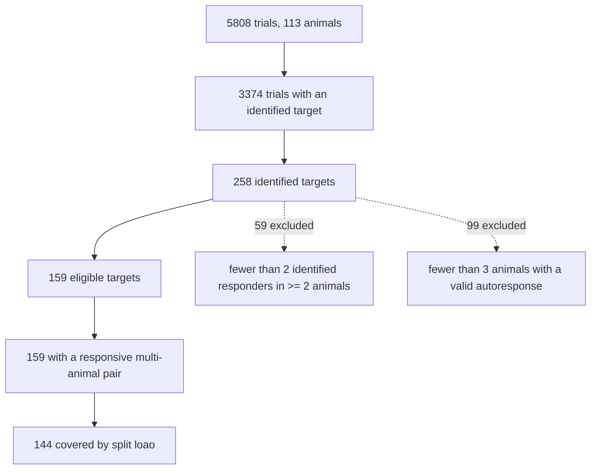

# M0 data audit (audit-v1)

> Generated by `python -m occamworm.analysis audit` from `data/normalized/randi2023-wt-v1` (manifest sha256 `76527dfb4a309b6e…`) and `configs/datasets/eligibility.json`, code revision `cf87cec6c67a`. Do not edit by hand. Spec: §2.3.

**Go/no-go: go.** 144 targets meet the criterion under the chosen split `loao`.

## Counts

- Animals 113, recordings 113, sessions 113, trials 5808.
- Animals by genotype: wild-type: 113. Only wild-type is imported; the unc-31 export is registered for M6 and not counted here. No sample size is assumed for any genotype.
- Animal identity: one recording per animal (flag animal_id_assumed_one_recording_per_animal).
- Trials by target code: failed_targeting: 1011, identified_untracked: 24, not_located: 162, roi: 4611.
- Identified stimulation targets: 258 (3374 trials).
- ROIs 14421; label status: blank: 5835, name: 7760, numeric: 38, other: 788.

## Inclusion flowchart

## Data quality

- Autoresponses: 4610 trials have one; 2824 are valid (>= 0.8 of window samples tracked); 3636 have a defined response amplitude.
- Sham events: 0. The export contains no sham (light-off) stimulations; B0 is fit from pre-stimulus and non-responding data.
- Window samples valid: 59.3% of 53411960; windows without a usable baseline 215527; without a response amplitude 272819.
- ROIs with uncertain identity (not a unique name): 6661.
- Trial QC flags: duplicate_stim_frame: 2, file_order_differs_from_time_order: 63, manual_target_superseded_by_export: 4, target_code_reconciled_from_manual_file: 4, target_failed_targeting: 1011, target_identified_untracked: 24, target_not_located: 162.

## Stimulus and timing

- Sampling 2 Hz (0.5 s volumes). Window: 10 volumes before, 60 from the stimulation; amplitude is the mean dF/F over offsets [1, 30].
- Stimulus duration known for 0 trials, amplitude for 0 (the pulse rate is not exported).
- Optogenetics: twoPhoton: 5808; pulses 0: 1, 150000: 79, 250000: 5728; trains 0: 1, 1: 5807.
- Inter-stimulus interval (s): n=5695, median 31 (IQR 30.5–31, range 0–118).
- Response volumes before the next stimulation: n=5695, median 60 (IQR 60–60, range 0–60).
- Stimulations per recording: n=113, median 55 (IQR 43–65, range 3–92); recording duration (s): n=113, median 1.9e+03 (IQR 1.53e+03–2.2e+03, range 196–2.92e+03).
- Trials whose previous target had the same label: 83.

## Within-recording drift

Per-animal least-squares slopes, mean across animals with an animal-level bootstrap 95% interval.

- `autoresponse_amplitude_vs_stim_index`: -0.00149 dF/F per stimulation (95% CI -0.00265 to -0.00027, 102 animals).
- `mean_abs_responder_amplitude_vs_stim_index`: 0.000288 dF/F per stimulation (95% CI 7.71e-05 to 0.000475, 109 animals).
- `mean_log_baseline_f0_vs_elapsed_time`: -0.0192 log units per minute (95% CI -0.0208 to -0.0177, 109 animals).

## Pairs and replication

- Observed (identified target, identified responder) pairs: 37040.
- Pairs by number of animals: 1: 13770, 2: 5694, 3-4: 6560, 5-9: 7143, 10+: 3873.
- Pairs by number of trials: 1: 11685, 2: 5806, 3-4: 6731, 5-9: 7410, 10+: 5408.
- Pairs with at least k animals: k=2: 23270 (62.8%), k=3: 17576 (47.5%), k=5: 11016 (29.7%).
- Distinct responders per target: n=258, median 154 (IQR 87–195, range 16–255); observed in >= 2 animals: n=258, median 98.5 (IQR 16.2–154, range 0–218).
- Trial-to-trial vs animal-to-animal variance (12114 estimable pairs): median between-animal fraction 0.375; pooled within 0.0139, between 0.00983. One-way random-effects ANOVA per (target, responder) pair with >= 2 animals and a repeat.

## Indicator

- Indicator: GCaMP6s, nuclear-localized; strain AML462 (pan-neuronal nuclear GCaMP6s, GUR-3/PRDX-2 optogenetics, NeuroPAL). Source: Randi et al. 2023, Nature 623:406 (arXiv:2208.04790), Methods; CGC strain AML462.
- No kinetic parameters for nuclear GCaMP6s in this preparation are taken from the literature yet; the indicator impulse response is estimated from autoresponses (OW-005).
- Strong autoresponses (peak >= 3.0× pre-stimulus SD): 2084. Peak latency (s): n=2084, median 7 (IQR 1.5–8.5, range 0–9.5). Time to half peak (s): n=2084, median 1 (IQR 0–4.5, range 0–9.5). Half-decay after peak (s): n=1989, median 1 (IQR 0.5–4.5, range 0.5–24); censored 95. Window resolution is the 0.5 s volume interval; decay is censored at the window end or next stimulation.

## Neuron ID intersection

- pending OW-013 (305 atlas IDs).

## Split scheme selection

Rule: most eligible targets covered (tested in an outer fold and fit+validated in at least one inner fold of every outer fold that tests it); ties broken by fewer outer folds. Chosen: **loao**.

| name | outer | n_outer_folds | inner_folds | eligible_targets_covered | eligible_targets_tested_without_inner_coverage | median_test_animals_per_target |
| --- | --- | --- | --- | --- | --- | --- |
| group5 | group_kfold | 5 | 3 | 125 | 34 | 9 |
| group10 | group_kfold | 10 | 3 | 127 | 32 | 9 |
| loao | leave_one_animal_out | 113 | 5 | 144 | 15 | 9 |

Per-target fold coverage: `fold_coverage.parquet`.

## Eligible targets

| target | n_animals | n_animals_valid_autoresponse | n_trials | responders_multi_animal | responsive_pairs |
| --- | --- | --- | --- | --- | --- |
| ADAL | 20 | 11 | 24 | 169 | 5 |
| ADAR | 21 | 15 | 26 | 174 | 6 |
| ADEL | 9 | 4 | 12 | 119 | 8 |
| ADER | 15 | 11 | 21 | 145 | 7 |
| ADFL | 3 | 3 | 3 | 58 | 5 |
| ADLL | 13 | 8 | 13 | 149 | 10 |
| ADLR | 9 | 9 | 9 | 142 | 9 |
| AFDL | 7 | 6 | 8 | 125 | 9 |
| AFDR | 4 | 3 | 4 | 83 | 17 |
| AIM | 3 | 3 | 5 | 33 | 3 |
| AIML | 15 | 8 | 20 | 160 | 17 |
| AIMR | 19 | 13 | 26 | 169 | 7 |
| AINL | 15 | 12 | 15 | 155 | 13 |
| AINR | 7 | 7 | 8 | 125 | 13 |
| AIYL | 7 | 6 | 10 | 131 | 6 |
| AIZL | 10 | 8 | 14 | 147 | 11 |
| AIZR | 14 | 13 | 17 | 152 | 5 |
| ALA | 4 | 4 | 4 | 84 | 17 |
| AMSoL | 5 | 5 | 6 | 77 | 7 |
| AMSoR | 3 | 3 | 4 | 51 | 5 |
| AMso | 5 | 4 | 7 | 62 | 2 |
| AQR | 26 | 20 | 42 | 174 | 3 |
| ASEL | 16 | 12 | 16 | 156 | 9 |
| ASER | 10 | 9 | 12 | 142 | 9 |
| ASGL | 16 | 10 | 19 | 160 | 11 |
| ASGR | 6 | 5 | 6 | 99 | 14 |
| ASHL | 31 | 16 | 38 | 184 | 20 |
| ASHR | 14 | 7 | 16 | 145 | 13 |
| ASIL | 9 | 7 | 10 | 119 | 7 |
| ASIR | 10 | 9 | 16 | 133 | 16 |
| ASJL | 12 | 11 | 14 | 155 | 9 |
| ASJR | 4 | 3 | 5 | 98 | 9 |
| ASKL | 10 | 9 | 11 | 144 | 12 |
| AUAL | 5 | 3 | 6 | 112 | 17 |
| AUAR | 7 | 3 | 11 | 118 | 11 |
| AVAL | 12 | 9 | 17 | 150 | 9 |
| AVAR | 16 | 9 | 23 | 154 | 11 |
| AVBL | 5 | 5 | 6 | 111 | 12 |
| AVBR | 5 | 4 | 5 | 119 | 10 |
| AVDL | 27 | 12 | 34 | 176 | 12 |
| AVDR | 35 | 19 | 42 | 191 | 4 |
| AVEL | 41 | 26 | 66 | 184 | 9 |
| AVER | 45 | 27 | 62 | 197 | 18 |
| AVG | 13 | 13 | 15 | 150 | 5 |
| AVHL | 15 | 12 | 16 | 161 | 12 |
| AVHR | 9 | 5 | 11 | 123 | 7 |
| AVJL | 50 | 29 | 67 | 207 | 14 |
| AVJR | 34 | 22 | 49 | 185 | 16 |
| AVKL | 5 | 4 | 5 | 100 | 5 |
| AVKR | 9 | 6 | 10 | 141 | 8 |
| AWAL | 20 | 11 | 21 | 170 | 13 |
| AWAR | 10 | 5 | 15 | 141 | 14 |
| AWBL | 43 | 27 | 65 | 198 | 22 |
| AWBR | 33 | 17 | 42 | 194 | 17 |
| AWCOFF | 15 | 12 | 17 | 167 | 4 |
| AWCON | 9 | 7 | 13 | 115 | 9 |
| BAGL | 15 | 11 | 16 | 154 | 8 |
| BAGR | 9 | 8 | 11 | 117 | 7 |
| CEPDL | 12 | 6 | 14 | 122 | 12 |
| CEPDR | 19 | 7 | 22 | 163 | 10 |
| CEPV | 3 | 3 | 3 | 18 | 4 |
| CEPVL | 17 | 12 | 21 | 146 | 4 |
| CEPVR | 14 | 9 | 17 | 134 | 10 |
| DB2 | 13 | 11 | 16 | 142 | 10 |
| FLPL | 27 | 14 | 34 | 176 | 5 |
| FLPR | 36 | 20 | 45 | 188 | 5 |
| I1L | 19 | 15 | 24 | 168 | 7 |
| I1R | 16 | 11 | 18 | 157 | 13 |
| I2L | 21 | 8 | 24 | 166 | 13 |
| I2R | 22 | 15 | 24 | 167 | 7 |
| I3 | 23 | 10 | 30 | 162 | 11 |
| I4 | 15 | 8 | 15 | 155 | 18 |
| I6 | 18 | 16 | 20 | 162 | 12 |
| IL1DL | 29 | 17 | 37 | 180 | 6 |
| IL1DR | 15 | 11 | 24 | 133 | 13 |
| IL1R | 4 | 4 | 5 | 63 | 7 |
| IL1V | 4 | 4 | 5 | 31 | 5 |
| IL1VL | 27 | 20 | 32 | 182 | 9 |
| IL1VR | 25 | 20 | 30 | 174 | 6 |
| IL2D | 3 | 3 | 7 | 36 | 2 |
| IL2DL | 11 | 6 | 11 | 121 | 7 |
| IL2DR | 7 | 4 | 11 | 99 | 9 |
| IL2R | 5 | 4 | 5 | 83 | 14 |
| IL2VL | 3 | 3 | 4 | 47 | 7 |
| M1 | 25 | 14 | 26 | 180 | 11 |
| M2L | 13 | 8 | 14 | 152 | 9 |
| M2R | 10 | 6 | 11 | 142 | 10 |
| M3L | 38 | 27 | 47 | 186 | 17 |
| M3R | 36 | 32 | 49 | 193 | 18 |
| M5 | 15 | 13 | 15 | 160 | 19 |
| MCL | 5 | 3 | 5 | 106 | 14 |
| MCR | 4 | 3 | 4 | 89 | 8 |
| MI | 19 | 17 | 19 | 166 | 13 |
| NSMR | 3 | 3 | 5 | 49 | 2 |
| OLLL | 32 | 25 | 40 | 185 | 14 |
| OLLR | 24 | 15 | 34 | 170 | 19 |
| OLQD | 3 | 3 | 4 | 25 | 3 |
| OLQDL | 19 | 15 | 31 | 165 | 7 |
| OLQDR | 25 | 18 | 32 | 178 | 9 |
| OLQVL | 18 | 10 | 23 | 153 | 8 |
| OLQVR | 18 | 12 | 27 | 143 | 10 |
| RIAL | 11 | 8 | 14 | 151 | 7 |
| RIAR | 16 | 11 | 22 | 158 | 8 |
| RIBL | 5 | 3 | 5 | 96 | 9 |
| RIBR | 5 | 3 | 5 | 110 | 15 |
| RICL | 9 | 6 | 9 | 146 | 13 |
| RICR | 15 | 9 | 15 | 158 | 8 |
| RID | 7 | 4 | 12 | 106 | 6 |
| RIGL | 16 | 12 | 17 | 166 | 8 |
| RIGR | 23 | 14 | 25 | 171 | 10 |
| RIML | 24 | 18 | 34 | 172 | 6 |
| RIMR | 28 | 15 | 38 | 185 | 11 |
| RIS | 5 | 5 | 5 | 90 | 12 |
| RIV | 4 | 3 | 5 | 44 | 2 |
| RIVL | 13 | 11 | 14 | 143 | 17 |
| RIVR | 20 | 15 | 29 | 160 | 18 |
| RMDD | 4 | 4 | 6 | 41 | 2 |
| RMDDL | 34 | 23 | 48 | 179 | 12 |
| RMDDR | 33 | 26 | 43 | 179 | 11 |
| RMDL | 25 | 16 | 32 | 169 | 12 |
| RMDR | 23 | 15 | 31 | 163 | 7 |
| RMDVL | 53 | 32 | 88 | 206 | 15 |
| RMDVR | 55 | 29 | 95 | 218 | 18 |
| RMED | 4 | 3 | 4 | 68 | 11 |
| RMEL | 32 | 17 | 46 | 183 | 8 |
| RMER | 44 | 29 | 51 | 205 | 14 |
| RMEV | 9 | 8 | 9 | 122 | 14 |
| RMFL | 3 | 3 | 3 | 58 | 10 |
| RMFR | 4 | 3 | 4 | 94 | 11 |
| RMGL | 5 | 3 | 6 | 115 | 15 |
| SAADL | 11 | 8 | 12 | 135 | 13 |
| SAADR | 6 | 4 | 6 | 83 | 3 |
| SAAVL | 16 | 11 | 20 | 144 | 11 |
| SAAVR | 23 | 11 | 26 | 173 | 10 |
| SABD | 8 | 7 | 11 | 122 | 8 |
| SABVR | 3 | 3 | 4 | 48 | 8 |
| SMBDR | 3 | 3 | 3 | 52 | 7 |
| SMBVL | 7 | 5 | 9 | 108 | 9 |
| SMDD | 5 | 4 | 6 | 55 | 4 |
| SMDDL | 20 | 10 | 28 | 169 | 11 |
| SMDDR | 13 | 10 | 16 | 145 | 4 |
| SMDVL | 10 | 5 | 16 | 140 | 19 |
| SMDVR | 10 | 7 | 13 | 123 | 14 |
| URADL | 13 | 8 | 13 | 150 | 9 |
| URADR | 8 | 6 | 8 | 134 | 16 |
| URAVL | 6 | 4 | 6 | 95 | 9 |
| URAVR | 3 | 3 | 3 | 65 | 13 |
| URBL | 13 | 9 | 17 | 140 | 10 |
| URBR | 12 | 11 | 13 | 148 | 9 |
| URX | 8 | 6 | 12 | 69 | 2 |
| URXL | 31 | 13 | 44 | 177 | 16 |
| URXR | 25 | 16 | 30 | 174 | 5 |
| URYDL | 12 | 7 | 14 | 138 | 6 |
| URYDR | 9 | 7 | 11 | 126 | 11 |
| URYVL | 15 | 7 | 15 | 153 | 5 |
| URYVR | 15 | 10 | 22 | 149 | 15 |
| VA1 | 3 | 3 | 3 | 44 | 11 |
| VB1 | 29 | 25 | 40 | 191 | 3 |
| VB2 | 24 | 16 | 27 | 175 | 3 |

Go/no-go criterion: at least one specified collection of stimulus targets admits animal-held-out evaluation with nontrivial response variability: eligible targets covered by the chosen split that have at least one responder with |t| >= 3.0 across >= 2 animals. Targets: ADAL, ADAR, ADEL, ADER, ADFL, ADLL, ADLR, AFDL, AFDR, AIML, AIMR, AINL, AINR, AIYL, AIZL, AIZR, ALA, AMSoL, AMso, AQR, ASEL, ASER, ASGL, ASGR, ASHL, ASHR, ASIL, ASIR, ASJL, ASJR, ASKL, AVAL, AVAR, AVBL, AVBR, AVDL, AVDR, AVEL, AVER, AVG, AVHL, AVJL, AVJR, AVKR, AWAL, AWAR, AWBL, AWBR, AWCOFF, AWCON, BAGL, BAGR, CEPDL, CEPDR, CEPV, CEPVL, CEPVR, DB2, FLPL, FLPR, I1L, I1R, I2L, I2R, I3, I4, I6, IL1DL, IL1DR, IL1R, IL1V, IL1VL, IL1VR, IL2DL, IL2DR, IL2R, IL2VL, M1, M2L, M2R, M3L, M3R, M5, MCL, MI, NSMR, OLLL, OLLR, OLQDL, OLQDR, OLQVL, OLQVR, RIAL, RIAR, RIBR, RICL, RICR, RID, RIGL, RIGR, RIML, RIMR, RIS, RIVL, RIVR, RMDD, RMDDL, RMDDR, RMDL, RMDR, RMDVL, RMDVR, RMED, RMEL, RMER, RMEV, RMFL, RMGL, SAADL, SAADR, SAAVL, SAAVR, SABD, SABVR, SMBVL, SMDDL, SMDDR, SMDVL, SMDVR, URADL, URADR, URAVL, URBL, URBR, URX, URXL, URXR, URYDL, URYDR, URYVL, URYVR, VA1, VB1, VB2.
