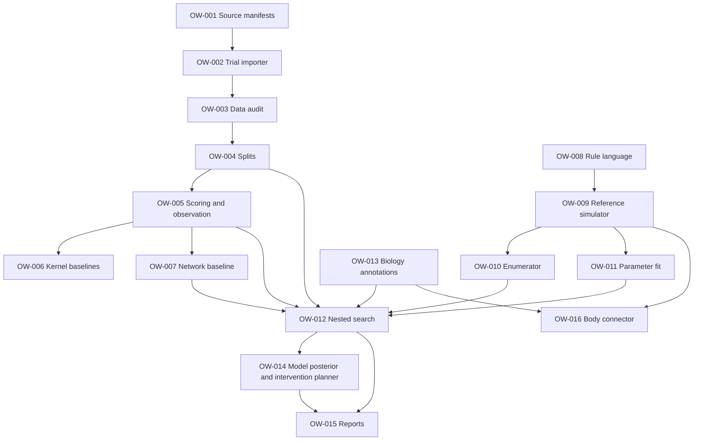

# Implementation tickets

> Part of the **Occam's Worm specification v0.4.1** · [Spec index](../../README.md) · Source: §21

Each ticket has an objectively checkable definition of done. Milestone assignments follow the task lists in the [roadmap](../ROADMAP.md).

| Ticket | Title | Milestone | Depends on | Release |
| --- | --- | --- | --- | --- |
| [OW-001](OW-001.md) | Source acquisition and version manifest | M0 | — | Minimum viable scientific release |
| [OW-002](OW-002.md) | `pumpprobe` trial-level adapter | M0 | OW-001 | Minimum viable scientific release |
| [OW-003](OW-003.md) | Dataset audit report | M0 | OW-002 | Minimum viable scientific release |
| [OW-004](OW-004.md) | Animal-wise splitter | M0–M1 | OW-003 | Minimum viable scientific release |
| [OW-005](OW-005.md) | Trace scorer and observation model | M1 | OW-004 | Minimum viable scientific release |
| [OW-006](OW-006.md) | Shared kernel and independent kernel baselines | M1 | OW-005 | Minimum viable scientific release |
| [OW-007](OW-007.md) | Linear anatomical network baseline | M1 | OW-005 | Minimum viable scientific release |
| [OW-008](OW-008.md) | WRL AST and units | M2 | — | Minimum viable engine |
| [OW-009](OW-009.md) | Deterministic sparse runtime | M2 | OW-008 | Minimum viable engine |
| [OW-010](OW-010.md) | Program enumerator and deduplicator | M3 | OW-009 | Minimum viable engine |
| [OW-011](OW-011.md) | Parameter optimization | M3 | OW-009 | Minimum viable engine |
| [OW-012](OW-012.md) | Nested rule search | M3–M4 | OW-004, OW-005, OW-007, OW-010, OW-011, OW-013 | Minimum viable engine |
| [OW-013](OW-013.md) | Biological annotation mapping | before M4 | — | Minimum viable engine |
| [OW-014](OW-014.md) | Program posterior and experimental planner | M5 | OW-012 | Experiment design (after engine) |
| [OW-015](OW-015.md) | Reproducible paper-quality report | M1 onward | OW-012 | Minimum viable engine |
| [OW-016](OW-016.md) | Optional embodiment connector | M7 | OW-009, OW-013 | Embodiment (after engine) |

## 21.1 Dependency graph

## 21.2 MVP boundary

**The genuine minimum viable scientific release is OW-001 through OW-007 plus audit/reporting.** It can already establish whether the shared-timescale claim survives animal-wise evaluation. Do not hold this release hostage to the compiler, GPU optimization, experimental planner or virtual body.

**The minimum viable Occam's Worm engine is OW-001 through OW-013 and OW-015**, with G0/G1 grammar, synthetic recovery, and real-data baseline comparisons. OW-014 adds experimental design; OW-016 adds embodiment.
